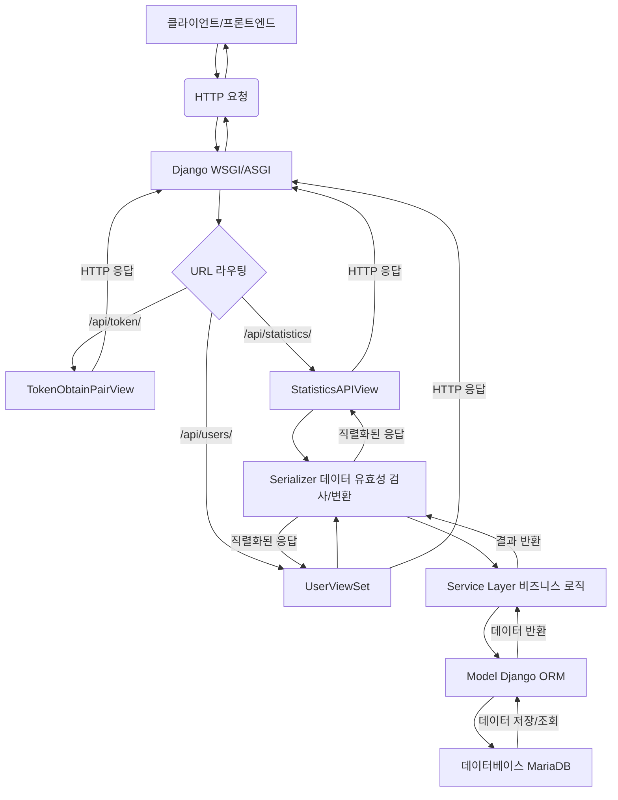

# 백엔드 데이터 흐름 및 아키텍처 (Backend Data Flow & Architecture)

이 문서는 Django REST Framework 기반의 백엔드 애플리케이션에서 HTTP 요청이 들어왔을 때, 데이터가 어떤 아키텍처 구성 요소를 거쳐 처리되고 데이터베이스에 접근하는지 그 과정을 상세하게 설명합니다.

## 1. 전체 데이터 흐름 개요

백엔드에서 HTTP 요청은 다음과 같은 주요 단계를 거쳐 처리됩니다.

## 2. 구성 요소별 상세 설명

### 2.1. 클라이언트 (프론트엔드)

-   **역할**: 사용자 인터페이스를 통해 HTTP 요청(GET, POST 등)을 백엔드 서버로 보냅니다.
-   **예시**: React 애플리케이션의 `apiClient.js`를 통해 `http://localhost:8000/api/statistics/`와 같은 URL로 요청을 보냅니다.

### 2.2. Django WSGI/ASGI

-   **역할**: 웹 서버(예: Gunicorn, Nginx + uWSGI/Daphne)로부터 들어오는 HTTP 요청을 Django 애플리케이션으로 전달하는 게이트웨이 역할을 합니다.
-   **주요 파일**: `mes_backend/wsgi.py` 또는 `mes_backend/asgi.py`

### 2.3. URL 라우팅 (`mes_backend/urls.py`, `core/urls.py`)

-   **역할**: 들어온 HTTP 요청의 URL을 분석하여, 해당 요청을 처리할 백엔드의 특정 View(뷰)로 연결(라우팅)합니다.
-   **주요 파일**:
    -   `mes_backend/urls.py`: 프로젝트의 최상위 URL 설정 파일입니다. `path('api/', include('core.urls'))`와 같이 다른 앱의 URL 설정을 포함(include)합니다.
    -   `core/urls.py`: `core` 앱 내의 상세 URL들을 정의합니다.
        -   `rest_framework.routers.DefaultRouter`: `UserViewSet`, `ProductionOrderViewSet` 등 `ViewSet` 기반의 API들을 자동으로 URL에 연결합니다. (예: `/api/users/`, `/api/production-orders/`)
        -   `django.urls.path()`: `StatisticsAPIView`와 같이 `ViewSet`이 아닌 일반 `APIView`나 함수 기반 뷰는 `path()` 함수를 사용하여 명시적으로 URL을 등록합니다. (예: `/api/statistics/`)

### 2.4. View (뷰)

-   **역할**: URL 라우팅을 통해 요청을 전달받아 실제 비즈니스 로직을 수행하기 전/후의 처리를 담당합니다. HTTP 메서드(GET, POST 등)에 따라 다른 로직을 실행합니다.
-   **주요 파일**: `core/views/*.py` (예: `production_views.py`의 `StatisticsAPIView`)
-   **주요 기능**:
    -   **인증 (Authentication)**: 요청을 보낸 사용자가 누구인지 확인합니다.
    -   **권한 (Permission)**: 사용자가 해당 요청을 수행할 권한이 있는지 확인합니다.
    -   **입력 데이터 유효성 검사**: `Serializer`를 사용하여 클라이언트로부터 받은 데이터의 유효성을 검사합니다.
    -   **서비스 레이어 호출**: 복잡한 비즈니스 로직은 `Service Layer`에 위임합니다.
    -   **응답 생성**: 처리 결과를 `Response` 객체로 만들어 클라이언트에 반환합니다.

### 2.5. Serializer (직렬화기)

-   **역할**: Django 모델 객체와 JSON/Python 원시 데이터 타입 간의 변환을 담당합니다. 데이터의 유효성 검사 기능도 제공합니다.
-   **주요 파일**: `core/serializers/*.py`
-   **주요 기능**:
    -   **직렬화 (Serialization)**: 데이터베이스에서 가져온 모델 객체(Python 객체)를 클라이언트가 이해할 수 있는 JSON 형식으로 변환합니다.
    -   **역직렬화 (Deserialization)**: 클라이언트로부터 받은 JSON 데이터를 Django 모델 객체(Python 객체)로 변환하고, 데이터의 유효성을 검사합니다.

### 2.6. Service Layer (서비스 레이어)

-   **역할**: 애플리케이션의 핵심 비즈니스 로직을 캡슐화합니다. View는 Service Layer를 호출하여 비즈니스 로직을 수행하고, Service Layer는 Model(ORM)을 통해 데이터베이스와 상호작용합니다.
-   **주요 파일**: `core/services/*.py` (예: `haccp_service.py`, `production_service.py`)
-   **주요 기능**:
    -   데이터 조회, 생성, 수정, 삭제와 관련된 복잡한 로직.
    -   여러 모델에 걸친 트랜잭션 관리.
    -   특정 비즈니스 규칙(예: HACCP 준수율 계산, 생산 효율성 분석) 구현.

### 2.7. Model (모델 - Django ORM)

-   **역할**: 데이터베이스의 테이블 구조를 Python 클래스로 정의합니다. Django ORM(Object-Relational Mapper)을 통해 SQL 쿼리 없이 Python 코드로 데이터베이스와 상호작용할 수 있게 합니다.
-   **주요 파일**: `core/models/*.py`
-   **주요 기능**:
    -   데이터베이스 테이블 정의 (필드, 관계).
    -   데이터베이스 레코드 조회, 생성, 업데이트, 삭제.
    -   데이터 유효성 검사 (모델 레벨).

### 2.8. 데이터베이스 (MariaDB)

-   **역할**: 모든 애플리케이션 데이터를 영구적으로 저장하고 관리합니다.

## 3. 결론

백엔드 아키텍처는 요청을 받아들이는 View부터 비즈니스 로직을 처리하는 Service Layer, 그리고 데이터베이스와 상호작용하는 Model(ORM)에 이르기까지 명확하게 분리된 계층으로 구성되어 있습니다. 이러한 계층 구조는 코드의 재사용성, 유지보수성, 확장성을 높이는 데 기여합니다.