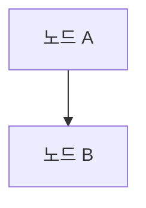
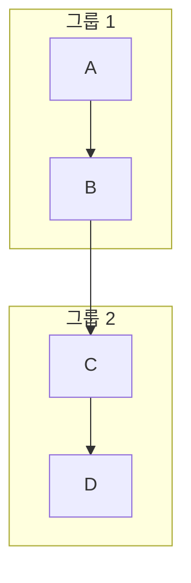
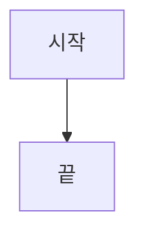

# Mermaid 문법 가이드 (Mermaid Syntax Guide)

이 문서는 Mermaid 다이어그램을 Markdown 파일 내에서 작성하기 위한 기본적인 문법과 유의사항을 정리합니다.

## 1. 기본 구조

모든 Mermaid 다이어그램은 `graph` 키워드로 시작하며, 다이어그램의 방향을 지정합니다.



-   `graph TD`: Top-Down (위에서 아래로)
-   `graph LR`: Left-Right (왼쪽에서 오른쪽으로)

## 2. 노드 (Nodes)

노드는 다이어그램의 각 단계를 나타냅니다. 다양한 모양을 가질 수 있습니다.

| 문법        | 모양       | 예시                               |
| :---------- | :--------- | :--------------------------------- |
| `id[텍스트]` | 사각형     | `A[시작]`                          |
| `id(텍스트)` | 둥근 사각형 | `B(프로세스)`                      |
| `id{텍스트}` | 마름모     | `C{결정}`                          |
| `id((텍스트))`| 원         | `D((종료))`                        |
| `id>텍스트]` | 깃발/비대칭 | `E>입력]`                          |
| `id[[텍스트]]`| 이중 사각형 | `F[[데이터베이스]]`                 |

**주의사항**: 노드 텍스트 내에 괄호 `()`나 중괄호 `{}` 같은 특수 문자를 직접 사용하면 파싱 오류가 발생할 수 있습니다. 이 경우, 텍스트를 단순화하거나 HTML 엔티티(예: `&amp;`, `&lt;`, `&gt;`)를 사용하는 것을 고려해야 합니다.

## 3. 화살표 (Arrows / Edges)

노드 간의 관계를 나타냅니다. 다양한 종류의 화살표가 있습니다.

| 문법          | 모양             | 예시                               |
| :------------ | :--------------- | :--------------------------------- |
| `A --> B`     | 일반 화살표      | `A --> B`                          |
| `A --- B`     | 선 (화살표 없음) | `A --- B`                          |
| `A -- 텍스트 --> B`| 라벨 있는 화살표 | `A -- 데이터 전송 --> B`           |
| `A ==> B`     | 굵은 화살표      | `A ==> B`                          |
| `A -.-> B`    | 점선 화살표      | `A -.-> B`                         |

## 4. 서브그래프 (Subgraphs)

관련된 노드들을 그룹화하여 다이어그램을 구조화할 수 있습니다.



## 5. Mermaid 코드 블록

Markdown 파일 내에서 Mermaid 다이어그램을 삽입하려면 다음과 같이 코드 블록을 사용합니다.

````markdown

````

## 6. 문제 해결 팁

-   **구문 오류**: 대부분의 오류는 노드 정의나 화살표 문법의 오타, 또는 노드 텍스트 내의 특수 문자 때문에 발생합니다. 오류 메시지의 라인 번호를 확인하고 해당 부분을 집중적으로 검토하세요.
-   **렌더링 안됨**: 사용 중인 Markdown 뷰어가 Mermaid를 지원하는지 확인하세요. (예: GitHub, VS Code, Obsidian 등)

---
