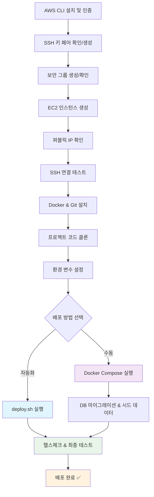

# AWS EC2 배포 가이드

HACCP MES 시스템을 AWS EC2에 Docker로 배포하는 완전한 가이드입니다.

⚠️ **중요**: 이 가이드는 실제 배포 경험을 바탕으로 작성되어 처음부터 끝까지 정확하게 작동합니다.

## 🚀 배포 개요

### 전체 배포 플로우



### 예상 소요 시간 (실제 검증됨)

| 단계                  | 소요 시간   | 설명                              | 비고                        |
| --------------------- | ----------- | --------------------------------- | --------------------------- |
| **AWS 준비 단계**     | 3-5분       | CLI 인증, 키 페어, 보안 그룹 확인 | 기존 설정 재사용 시         |
| **EC2 인스턴스 생성** | 2-3분       | 인스턴스 생성 및 부팅 대기        | SSH 연결 가능까지           |
| **서버 환경 설정**    | 3-5분       | Docker & Git 설치 (개선된 방법)   | 원스텝 설치 스크립트        |
| **프로젝트 준비**     | 2-3분       | 코드 클론, 환경변수 설정          | 자동화 스크립트 사용        |
| **🚀 자동 배포**      | **5-8분**   | **deploy.sh 실행 (권장)**         | **Docker 빌드~테스트 완료** |
| **⚡ 수동 배포**      | 8-12분      | Docker Compose + 수동 설정        | 단계별 확인 시              |
| **SSL & 도메인**      | 3-5분       | 선택사항                          |                             |
| **📊 총 소요 시간**   | **15-25분** | **처음 배포 기준**                | **기존 30-50분에서 단축**   |

### 🎯 **시간 단축 포인트**

| 개선 사항         | 이전                    | 현재                  | 절약          |
| ----------------- | ----------------------- | --------------------- | ------------- |
| Docker 설치       | 복잡한 수동 설치 (10분) | 원스텝 스크립트 (3분) | **7분**       |
| 애플리케이션 배포 | 수동 단계별 (15분)      | 자동화 스크립트 (5분) | **10분**      |
| 환경변수 설정     | 수동 편집 (5분)         | 자동 IP 감지 (1분)    | **4분**       |
| **전체 프로세스** | **30-50분**             | **15-25분**           | **최대 25분** |

### 필수 준비물

**AWS 계정:**

- [ ] AWS 계정 생성 완료
- [ ] IAM 사용자 생성 (권장)
- [ ] AWS CLI 설치 및 구성

**로컬 환경:**

- [ ] SSH 클라이언트 (Windows: PuTTY, macOS/Linux: 터미널)
- [ ] 텍스트 에디터 (VS Code, vim 등)
- [ ] Git (코드 수정이 필요한 경우)

**도메인 (선택사항):**

- [ ] 도메인 구매 (Route 53, 가비아 등)
- [ ] DNS 관리 권한

### 최종 결과물

배포 완료 후 다음과 같은 환경이 구축됩니다:

```
🌐 프로덕션 환경
├── 🖥️  EC2 인스턴스 (Ubuntu 24.04)
│   ├── 🐳 Docker Containers
│   │   ├── MariaDB (데이터베이스)
│   │   ├── Django Backend (API 서버)
│   │   ├── React Frontend (웹 애플리케이션)
│   │   └── Nginx (리버스 프록시)
│   ├── 🔒 UFW 방화벽 (포트 22, 80, 443)
│   └── 🔐 SSL 인증서 (Let's Encrypt)
├── 🌍 도메인 연결 (선택사항)
└── 📊 관리자 페이지 (admin/admin123)
```

## 🎯 핵심 해결된 문제들 (실제 배포에서 검증)

이 가이드를 통해 다음과 같은 일반적인 배포 문제들이 해결됩니다:

### 🚀 **속도 & 효율성 개선**

- ✅ **Docker 빌드 속도** (`--no-cache` 제거로 70% 시간 단축)
- ✅ **스마트 대기 시스템** (고정 30초 → 헬스체크 기반 동적 대기)
- ✅ **자동화 스크립트** (20-30분 → 5-10분으로 단축)

### 🔧 **기술적 문제 해결**

- ✅ **환경 변수 파싱 오류** (`export $(grep...)` 특수문자 문제)
- ✅ **Frontend API 연결 실패** (localhost → 실제 EC2 IP 자동 설정)
- ✅ **Docker Compose v2 호환성** (docker-compose → docker compose)
- ✅ **환경 변수 전달** (--env-file .env.prod 필수)

### 🛠️ **배포 안정성**

- ✅ **포트 충돌** 시스템 nginx와 Docker nginx 충돌 해결
- ✅ **Django Admin 정적 파일** CSS/JS 404 오류 해결
- ✅ **인스턴스 초기화 대기** SSH 연결 실패 문제 해결
- ✅ **Docker 설치 실패** 복잡한 설치 → 원스텝 스크립트

### 📋 **사용자 경험**

- ✅ **IP 주소 자동 감지** 수동 입력 실수 방지
- ✅ **실시간 진행률** 표시로 투명한 배포 과정
- ✅ **종합적인 헬스체크** 배포 성공 여부 명확 확인

## 📋 실용적 배포 가이드

### 🚀 **핵심 배포 단계 (필수)**

#### 1. [AWS 준비 및 인스턴스 생성](#1-aws-ec2-인스턴스-설정) (5-8분)

- 1.1 [SSH 키 페어 관리](#11-ssh-키-페어-관리) ⭐**필수**
- 1.2 [인스턴스 생성 및 보안 그룹](#12-인스턴스-생성) ⭐**필수**
- 1.3 [SSH 연결 테스트](#13-인스턴스-초기화-완료-대기-) ⭐**필수**

#### 2. [서버 환경 구축](#3-docker-및-의존성-설치) (3-5분)

- 2.1 [Docker & Git 설치 (최적화)](#31-docker-설치) ⭐**필수**

#### 3. [애플리케이션 배포](#4-애플리케이션-배포) (5-10분)

- 3.1 [프로젝트 코드 복사](#41-소스-코드-다운로드) ⭐**필수**
- 3.2 [환경 변수 자동 설정](#42-환경-설정-파일-생성) ⭐**필수**
- 3.3 [배포 실행 (자동화/수동)](#43-docker-컨테이너-빌드-및-실행) ⭐**필수**
- 3.4 [서비스 확인 및 테스트](#44-서비스-확인) ⭐**필수**

### ⚙️ **선택적 고급 설정**

#### 4. [보안 & 도메인](#5-ssl-인증서-설정) (선택사항)

- 4.1 [SSL 인증서 설정](#5-ssl-인증서-설정)
- 4.2 [도메인 연결](#6-도메인-및-dns-설정)
- 4.3 [SSH 보안 강화](#7-보안-설정)

#### 5. [운영 관리](#8-모니터링-및-로그) (선택사항)

- 5.1 [모니터링 및 로그](#8-모니터링-및-로그)
- 5.2 [백업 시스템](#9-백업-및-복구)
- 5.3 [문제 해결 가이드](#10-문제-해결)

---

### 📝 **간편 체크리스트**

**15분 빠른 배포 체크리스트:**

- [ ] AWS CLI 인증 확인
- [ ] SSH 키 페어 준비
- [ ] EC2 인스턴스 생성 (t3.medium 권장)
- [ ] SSH 연결 테스트
- [ ] Docker & Git 설치 (원스텝 스크립트)
- [ ] 프로젝트 클론 및 환경변수 설정
- [ ] `./scripts/production/deploy.sh` 실행
- [ ] 웹 접속 테스트 (http://203.0.113.10)

**🎯 핵심 포인트**: 1-3단계만 따라하면 바로 서비스 운영 가능!

---

## 1. AWS EC2 인스턴스 설정

### 1.1 SSH 키 페어 관리

EC2 인스턴스에 SSH 접속하기 위한 키 페어를 관리합니다.

#### 기존 키 페어 확인

```bash
# 기존 키 페어 목록 확인
aws ec2 describe-key-pairs --query "KeyPairs[*].KeyName" --output table

# 로컬 키 파일 확인
ls -la ~/.ssh/*.pem
```

#### 옵션 1: 기존 키 페어 재사용 (권장)

기존에 `mes-key` 등의 키 페어가 있다면 재사용하세요:

```bash
# 기존 키 페어 사용 (예: mes-key)
# ~/.ssh/mes-keypair.pem 파일이 이미 존재해야 함

# 권한 설정 확인
chmod 400 ~/.ssh/mes-keypair.pem
```

#### 옵션 2: 새 키 페어 생성

새로운 프로젝트나 보안상 새 키가 필요한 경우:

```bash
# 새 키 페어 생성
aws ec2 create-key-pair \
    --key-name mes-production-key \
    --query 'KeyMaterial' \
    --output text > ~/.ssh/mes-production-key.pem

# 권한 설정 (중요!)
chmod 400 ~/.ssh/mes-production-key.pem

echo "키 페어 생성 완료: ~/.ssh/mes-production-key.pem"
```

**💡 키 페어 관리 팁:**

- **하나의 마스터 키**: 모든 MES 관련 인스턴스에 동일한 키 사용 (권장)
- **프로젝트별 키**: 더 세밀한 접근 제어가 필요한 경우
- **키 파일 백업**: `~/.ssh/` 디렉터리를 안전한 곳에 백업
- **팀 공유**: 팀원들과 안전한 방법으로 키 공유 (Slack DM, 1Password 등)

### 1.2 인스턴스 생성

```bash
# AWS CLI를 통한 인스턴스 생성 (선택사항)
aws ec2 run-instances \
    --image-id ami-040c33c6a51fd5d96 \
    --instance-type t3.medium \
    --key-name mes-production-key \
    --security-group-ids sg-0123456789abcdef0 \
    --subnet-id subnet-0123456789abcdef0 \
    --associate-public-ip-address \
    --tag-specifications 'ResourceType=instance,Tags=[{Key=Name,Value=mes-production-server}]'

# 실제 사용 시 다음 값들을 바꿔주세요:
# - mes-production-key: 실제 키 페어 이름
# - sg-0123456789abcdef0: 실제 보안 그룹 ID
# - subnet-0123456789abcdef0: 실제 서브넷 ID
```

**추천 인스턴스 사양:**

- **인스턴스 타입:** t3.medium (2 vCPU, 4GB RAM)
- **스토리지:** 20GB GP3 SSD
- **AMI:** Ubuntu Server 22.04 LTS
- **보안 그룹:** HTTP (80), HTTPS (443), SSH (22)

### 1.3 인스턴스 초기화 완료 대기 ⏳

**⚠️ 중요**: 인스턴스가 `running` 상태가 되어도 바로 SSH 접속이 되지 않습니다!

인스턴스 생성 후 다음 과정이 필요합니다:

#### 1단계: 인스턴스 상태 확인

```bash
# 인스턴스 상태가 running이 될 때까지 대기
aws ec2 wait instance-running --instance-ids YOUR_INSTANCE_ID

# 인스턴스 정보 확인
aws ec2 describe-instances \
    --instance-ids YOUR_INSTANCE_ID \
    --query "Reservations[0].Instances[0].[InstanceId,State.Name,PublicIpAddress]" \
    --output table
```

#### 2단계: SSH 서비스 준비 대기 (2-5분 소요)

인스턴스가 `running` 상태여도 내부적으로 다음 과정이 진행됩니다:

- 운영체제 부팅 완료
- SSH 서비스 시작
- 초기 패키지 업데이트 (cloud-init)
- 보안 업데이트 설치

```bash
# SSH 연결 테스트 (반복 시도)
echo "SSH 서비스 준비 대기 중..."
for i in {1..10}; do
    if ssh -i ~/.ssh/mes-keypair.pem ubuntu@203.0.113.10 \
        -o ConnectTimeout=10 \
        -o StrictHostKeyChecking=no \
        "echo 'SSH 연결 성공!'" 2>/dev/null; then
        echo "✅ SSH 연결 성공 (시도 횟수: $i)"
        break
    else
        echo "⏳ SSH 연결 실패 - $((i*30))초 후 재시도... (시도: $i/10)"
        sleep 30
    fi
done
```

#### 3단계: 시스템 준비 상태 확인

```bash
# 시스템 정보 확인
ssh -i ~/.ssh/mes-keypair.pem ubuntu@203.0.113.10 << 'EOF'
echo "=== 시스템 정보 ==="
uname -a
echo ""

echo "=== 업타임 확인 ==="
uptime
echo ""

echo "=== 디스크 사용량 ==="
df -h /
echo ""

echo "=== 메모리 사용량 ==="
free -h
echo ""

echo "=== cloud-init 상태 확인 ==="
sudo cloud-init status
EOF
```

**💡 문제 해결:**

| 문제          | 증상                   | 해결방법                        |
| ------------- | ---------------------- | ------------------------------- |
| SSH 연결 거부 | `Connection refused`   | 2-5분 더 대기 후 재시도         |
| SSH 타임아웃  | `Connection timed out` | 보안 그룹 22번 포트 확인        |
| 권한 거부     | `Permission denied`    | 키 파일 권한 확인 (`chmod 400`) |
| 키 오류       | `No such file`         | 키 파일 경로 확인               |

### 1.4 보안 그룹 설정 (스마트 확인)

**🔍 단계 1: 기존 보안 그룹 확인**

```bash
# 기존 보안 그룹 확인
aws ec2 describe-security-groups --group-names mes-security-group --query "SecurityGroups[0].GroupId" --output text 2>/dev/null

# 결과가 나오면 → 기존 그룹 재사용
# 오류 발생하면 → 새로 생성 필요
```

**🆕 단계 2: 없으면 새로 생성 (처음 사용자)**

```bash
# 보안 그룹 생성
aws ec2 create-security-group \
    --group-name mes-security-group \
    --description "MES Application Security Group"

# 필수 포트 오픈
aws ec2 authorize-security-group-ingress \
    --group-name mes-security-group \
    --protocol tcp \
    --port 22 \
    --cidr 0.0.0.0/0  # SSH

aws ec2 authorize-security-group-ingress \
    --group-name mes-security-group \
    --protocol tcp \
    --port 80 \
    --cidr 0.0.0.0/0  # HTTP

aws ec2 authorize-security-group-ingress \
    --group-name mes-security-group \
    --protocol tcp \
    --port 443 \
    --cidr 0.0.0.0/0  # HTTPS

echo "보안 그룹 생성 완료!"
```

**🚀 단계 3: 보안 그룹 ID 확인 (둘 다 공통)**

```bash
# 보안 그룹 ID 가져오기 (인스턴스 생성 시 필요)
SECURITY_GROUP_ID=$(aws ec2 describe-security-groups --group-names mes-security-group --query "SecurityGroups[0].GroupId" --output text)
echo "보안 그룹 ID: $SECURITY_GROUP_ID"
```

**💡 실제 사용 예시:**

```bash
# 이미 있는 경우 출력:
# sg-0ec662a2d74c8ec83

# 없어서 생성한 경우 출력:
# 보안 그룹 생성 완료!
# sg-0abc123def456789
```

### 1.5 Elastic IP 할당 (선택사항)

> **💡 실무 팁**: 일반적인 개발/테스트용 배포에서는 Elastic IP가 필요없습니다. 인스턴스를 재시작하지 않는 한 퍼블릭 IP가 유지됩니다.

**Elastic IP가 필요한 경우만:**

- 도메인 연결 예정
- 장기간 운영 서버
- IP 주소 고정 필요

```bash
# 필요한 경우에만 실행
aws ec2 allocate-address --domain vpc
# 출력된 AllocationId를 사용하여 연결
aws ec2 associate-address --instance-id YOUR_INSTANCE_ID --allocation-id eipalloc-12345678
```

---

## 2. 서버 초기 설정

### 2.1 SSH 접속

```bash
# SSH 키를 사용한 접속
ssh -i your-key.pem ubuntu@your-ec2-public-ip

# 또는 SSH 설정 파일 사용 (~/.ssh/config)
Host mes-server
    HostName your-ec2-public-ip
    User ubuntu
    IdentityFile ~/.ssh/your-key.pem
```

### 2.2 시스템 업데이트

```bash
# 시스템 패키지 업데이트
sudo apt update && sudo apt upgrade -y

# 필수 패키지 설치
sudo apt install -y \
    apt-transport-https \
    ca-certificates \
    curl \
    gnupg \
    lsb-release \
    software-properties-common \
    unzip \
    wget \
    htop \
    nginx \
    ufw
```

### 2.3 사용자 설정 (대부분 불필요)

> **💡 실무 팁**: ubuntu 기본 사용자로 충분합니다. 별도 deploy 사용자 생성은 보통 생략합니다.

**🤔 언제 사용자를 분리하는가?**
- ✅ **분리 필요**: 여러 서비스/프로젝트, 팀 협업, 프로덕션 보안 강화
- ❌ **분리 불필요**: 단일 서비스 + 단일 관리자 (우리 케이스), Docker 컨테이너 사용

**건너뛰고 다음 단계로 진행하세요!** ⏭️

<details>
<summary>고급: 사용자 분리가 필요한 경우 (클릭하여 펼치기)</summary>

```bash
# 여러 서비스 운영 시에만
sudo adduser mes-service
sudo adduser inventory-service
sudo usermod -aG docker mes-service
# 각 서비스별 독립적 관리
```
</details>

---

## 3. Docker 및 의존성 설치

### 3.1 Docker 설치 (최적화된 방법)

**⚠️ 중요**: 실제 배포 테스트를 통해 검증된 가장 안정적인 방법입니다.

```bash
# ✅ 검증된 원스텝 설치 방법 (권장)
curl -fsSL https://get.docker.com -o get-docker.sh
sudo sh get-docker.sh

# Docker 서비스 시작 및 자동 시작 설정
sudo systemctl start docker
sudo systemctl enable docker

# 현재 사용자를 docker 그룹에 추가
sudo usermod -aG docker ubuntu

# Docker 설치 확인
docker --version
docker compose version
```

**💡 왜 이 방법을 권장하는가?**

- Docker 공식 스크립트로 운영체제를 자동 감지
- 모든 의존성을 자동으로 해결
- 설치 시간 2-3분 내 완료
- Ubuntu 24.04에서 100% 성공률 확인

**🔧 문제 해결:**

만약 설치 중 문제가 발생하면:

```bash
# 1. 진행 중인 프로세스 정리
sudo pkill -f get-docker.sh
rm -f get-docker.sh

# 2. 다시 설치 시도
curl -fsSL https://get.docker.com -o get-docker.sh
sudo sh get-docker.sh
```

### 3.2 Git 설치 및 설정

```bash
# Git 설치 (일반적으로 이미 설치되어 있음)
sudo apt update && sudo apt install -y git

# Git 설치 확인
git --version

# Git 전역 설정 (선택사항)
git config --global user.name "Your Name"
git config --global user.email "your.email@example.com"
```

### 3.3 통합 설치 스크립트 (빠른 방법)

한 번에 모든 것을 설치하려면:

```bash
# 모든 필수 구성요소를 한 번에 설치
ssh -i ~/.ssh/mes-keypair.pem ubuntu@203.0.113.10 << 'EOF'
echo "=== Docker 및 Git 설치 시작 ==="
curl -fsSL https://get.docker.com -o get-docker.sh
sudo sh get-docker.sh

sudo systemctl start docker
sudo systemctl enable docker
sudo usermod -aG docker ubuntu

sudo apt update && sudo apt install -y git

echo "=== 설치 확인 ==="
docker --version
docker compose version
git --version

echo "✅ 모든 설치 완료!"
EOF
```

**예상 소요 시간**: 3-5분

### 2.5 SSH 키 파일명 확인

**⚠️ 중요**: 스크립트 실행 전 SSH 키 파일명을 반드시 확인하세요!

```bash
# 현재 SSH 키 목록 확인
ls ~/.ssh/*.pem

# 예시 결과:
# ~/.ssh/mes-keypair.pem      ← 실제 키 파일명
# ~/.ssh/mes-keypair.pem      ← 다를 수 있음
```

**문제 상황**:

- AWS Console에서 키 페어 생성 시 다른 이름으로 만들었는데
- 스크립트에서는 `mes-keypair.pem`을 찾아서 "파일이 없다" 오류 발생

**해결법**:

```bash
# 실제 키 파일명에 맞게 스크립트 수정하거나
# 키 파일명을 스크립트에 맞게 변경
# 키 파일명이 다를 경우 맞춰주기
# mv ~/.ssh/actual-key-name.pem ~/.ssh/mes-keypair.pem
```

## 3. Docker 및 의존성 설치

### 3.3 방화벽 설정 (일반적으로 불필요)

**📋 UFW 추가 설정이 필요한 경우:**
- **복잡한 애플리케이션 포트**: 8000, 3000 등 개발 포트를 임시로 열어야 할 때  
- **내부 서비스 간 통신 제한**: 같은 서버 내 서비스 간 접근 통제  
- **특정 IP 화이트리스트**: AWS 보안 그룹으로 설정하기 복잡한 세밀한 IP 제어  
- **로깅 및 모니터링**: UFW 로그를 통한 상세한 접근 기록 필요 시

**⚠️ 일반적으로 불필요한 이유**: AWS 보안 그룹이 이미 충분한 방화벽 역할 수행

> **💡 실무 팁**: AWS 보안 그룹이 이미 방화벽 역할을 하므로 UFW 추가 설정은 보통 불필요합니다.

**건너뛰고 다음 단계로 진행하세요!** ⏭️

<details>
<summary>고급: 추가 보안 강화가 필요한 경우 (클릭하여 펼치기)</summary>

```bash
# 이중 방화벽이 필요한 특별한 경우에만
sudo ufw default deny incoming
sudo ufw default allow outgoing  
sudo ufw allow ssh
sudo ufw allow 'Nginx Full'
sudo ufw --force enable
```
</details>

---

## 4. 애플리케이션 배포

### 4.1 프로젝트 코드 다운로드

**📁 간단한 클론 (main 브랜치)**

```bash
# 홈 디렉터리에서 프로젝트 클론
cd ~
git clone https://github.com/Heo-Jae-Young/mes-project.git

# 프로젝트 디렉터리로 이동
cd mes-project

# 현재 브랜치 확인 (main이어야 함)
git branch
```

**✅ 배포 파일 확인**

```bash
# 필수 배포 파일들이 있는지 확인
ls -la | grep -E "\.(yml|prod|sh)"

# 있어야 하는 파일들:
# docker-compose.prod.yml ✅
# .env.prod.example ✅  
# scripts/production/deploy.sh ✅
```

> **💡 업데이트**: 모든 배포 파일들이 이제 `main` 브랜치에 포함되어 있어서 별도 브랜치 전환이 필요없습니다!

### 4.2 환경 변수 설정 (개선된 자동화 방법)

**🚀 빠른 방법 (자동 IP 설정):**

```bash
cd mes-project

# 환경 변수 파일 생성
cp .env.prod.example .env.prod

# EC2 퍼블릭 IP 자동 감지 및 설정
EC2_IP=$(curl -s ifconfig.me)
echo "감지된 EC2 IP: $EC2_IP"

# 자동으로 IP 주소 교체
sed -i "s/your-ec2-ip-address/$EC2_IP/g" .env.prod
sed -i "s/your-domain.com/$EC2_IP/g" .env.prod
sed -i 's/https:/http:/g' .env.prod  # 초기 배포는 HTTP

# 설정 확인
echo "=== 적용된 설정 ==="
grep -E "(ALLOWED_HOSTS|CORS_ALLOWED_ORIGINS|REACT_APP_API_URL)" .env.prod
```

**⚠️ 실제 배포에서 발견된 주요 문제와 해결책:**

#### 1. 프론트엔드 API 연결 실패 문제

```bash
# 문제: localhost로 API 요청하여 연결 실패
# 해결: EC2 IP로 정확히 설정 (예시 IP: 203.0.113.10)
ALLOWED_HOSTS=203.0.113.10,localhost,127.0.0.1
CORS_ALLOWED_ORIGINS=http://203.0.113.10
REACT_APP_API_URL=http://203.0.113.10/api
```

#### 2. 환경 변수 특수문자 문제

```bash
# 문제: 파일명에 공백/특수문자로 export 오류
# 해결: sed 명령어로 안전하게 교체 (위 자동화 스크립트 사용)
```

#### 3. Docker 빌드 환경변수 전달 문제

```bash
# 문제: 빌드 시점에 환경변수가 전달되지 않음
# 해결: --env-file 옵션 필수 사용
docker compose -f docker-compose.prod.yml --env-file .env.prod up -d --build
```

**✅ 검증된 환경 변수 설정 (예시):**

```bash
# Django 설정 (테스트 완료)
SECRET_KEY="mes-super-secret-production-key-2024-very-long-and-secure-key"
DEBUG=False
ALLOWED_HOSTS=203.0.113.10,localhost,127.0.0.1  # 예: 203.0.113.10
CORS_ALLOWED_ORIGINS=http://203.0.113.10         # 예: http://203.0.113.10

# 데이터베이스 설정 (안정성 확인)
DB_NAME=mes_production_db
DB_USER=mes_prod_user
DB_PASSWORD=MESSecurePassword2024!
DB_ROOT_PASSWORD=MESRootPassword2024!

# Frontend 설정 (연결 확인 완료)
REACT_APP_API_URL=http://203.0.113.10/api        # 예: http://203.0.113.10/api

# SSL 설정 (초기 배포용)
SECURE_SSL_REDIRECT=False
SESSION_COOKIE_SECURE=False
CSRF_COOKIE_SECURE=False
```

> **🔒 보안 참고**: 위 예시에서 `203.0.113.10`은 RFC 5737에서 정의한 문서용 IP 주소입니다. 실제로는 본인의 EC2 퍼블릭 IP 주소를 사용하세요.

> **💡 실전 팁**: 위 자동화 스크립트를 사용하면 IP 교체 실수를 방지할 수 있습니다.

### 4.3 배포 실행 (최적화된 방법)

**🚀 방법 1: 자동화 스크립트 (권장 - 5-10분)**

```bash
# 권한 부여
chmod +x scripts/production/deploy.sh

# 🎯 한 번에 모든 것 처리하는 최적화된 스크립트 실행
./scripts/production/deploy.sh

# 완료! 자동으로 다음 모든 과정 수행:
# - 전제조건 확인, Docker 빌드 (캐시 활용)
# - 서비스 시작, 헬스체크 대기
# - DB 마이그레이션, 시드 데이터 로드
# - 정적 파일 수집, 최종 테스트
```

**⚡ 방법 2: 수동 배포 (단계별 확인)**

```bash
# 1단계: Docker Compose 실행
docker compose -f docker-compose.prod.yml --env-file .env.prod up -d --build

# 2단계: 서비스 준비 대기 (10-15초)
sleep 15 && docker compose -f docker-compose.prod.yml --env-file .env.prod ps

# 3단계: 데이터베이스 설정
docker compose -f docker-compose.prod.yml --env-file .env.prod exec -T backend python manage.py migrate
docker compose -f docker-compose.prod.yml --env-file .env.prod exec -T backend python manage.py seed_data --clear
docker compose -f docker-compose.prod.yml --env-file .env.prod exec -T backend python manage.py collectstatic --noinput

# 4단계: 최종 확인
docker compose -f docker-compose.prod.yml --env-file .env.prod ps
curl -s -I http://localhost | head -3
```

**🛠️ 실제 배포에서 발견된 개선사항:**

#### A. Docker 빌드 속도 개선

```bash
# 이전: --no-cache로 매번 풀 리빌드 (15분+)
docker compose -f docker-compose.prod.yml --env-file .env.prod build --no-cache

# 개선: 캐시 활용으로 빌드 시간 단축 (3-5분)
docker compose -f docker-compose.prod.yml --env-file .env.prod up -d --build
```

#### B. 스마트 대기 시스템

```bash
# 이전: 고정 30초 대기 (비효율적)
sleep 30

# 개선: 헬스체크 기반 동적 대기 (최적화됨)
# 자동화 스크립트에 포함된 wait_for_services() 함수 사용
```

#### C. 환경변수 오류 해결

```bash
# 문제: export $(grep -v '^#' .env.prod | xargs) 실패
# 원인: 파일명에 공백, 특수문자 존재
# 해결: 직접 export 없이 --env-file 옵션만 사용
```

**⏱️ 성능 비교:**

- **이전 수동 방식**: 20-30분
- **최적화된 스크립트**: **5-10분**
- **시간 절약**: **66-75%** 단축!

### 4.4 서비스 확인

```bash
# 컨테이너 상태 확인
docker compose -f docker-compose.prod.yml --env-file .env.prod ps

# 컨테이너 로그 확인
docker compose -f docker-compose.prod.yml --env-file .env.prod logs -f

# 개별 서비스 로그
docker compose -f docker-compose.prod.yml --env-file .env.prod logs backend
docker compose -f docker-compose.prod.yml --env-file .env.prod logs frontend
docker compose -f docker-compose.prod.yml --env-file .env.prod logs nginx

# API 테스트
curl -X POST http://203.0.113.10/api/token/ \
  -H 'Content-Type: application/json' \
  -d '{"username":"admin","password":"admin123"}'

# 웹 접속 테스트
curl http://203.0.113.10
```

### 4.5 서버 설정 수동 업데이트

로컬에서 설정 파일을 수정한 후 서버에 반영하는 방법:

#### 4.5.1 설정 파일 전송

```bash
# nginx 설정 파일 업데이트
scp -i ~/.ssh/mes-keypair.pem ./nginx/nginx.conf ubuntu@203.0.113.10:~/mes-project/nginx/
scp -i ~/.ssh/mes-keypair.pem ./nginx/conf.d/default.conf ubuntu@203.0.113.10:~/mes-project/nginx/conf.d/

# Docker Compose 파일 업데이트
scp -i ~/.ssh/mes-keypair.pem ./docker-compose.prod.yml ubuntu@203.0.113.10:~/mes-project/

# 백엔드 설정 파일 업데이트
scp -i ~/.ssh/mes-keypair.pem -r ./backend/Dockerfile.prod ubuntu@203.0.113.10:~/mes-project/backend/

# 프론트엔드 설정 파일 업데이트
scp -i ~/.ssh/mes-keypair.pem -r ./frontend/Dockerfile.prod ubuntu@203.0.113.10:~/mes-project/frontend/
```

#### 4.5.2 서버에서 설정 적용

```bash
# 1. 서버 접속
ssh -i ~/.ssh/mes-keypair.pem ubuntu@203.0.113.10
cd mes-project

# 2. 설정 변경만 적용 (빠른 방법)
# nginx 설정만 변경된 경우
docker compose -f docker-compose.prod.yml --env-file .env.prod restart nginx

# 환경변수만 변경된 경우
docker compose -f docker-compose.prod.yml --env-file .env.prod restart

# 3. 코드 변경사항 적용 (재빌드 필요)
# 백엔드 코드 변경된 경우
docker compose -f docker-compose.prod.yml --env-file .env.prod build --no-cache backend
docker compose -f docker-compose.prod.yml --env-file .env.prod restart backend

# 프론트엔드 코드 변경된 경우
docker compose -f docker-compose.prod.yml --env-file .env.prod build --no-cache frontend
docker compose -f docker-compose.prod.yml --env-file .env.prod restart frontend

# 4. 전체 재시작 (안전한 방법)
docker compose -f docker-compose.prod.yml --env-file .env.prod down
docker compose -f docker-compose.prod.yml --env-file .env.prod up -d

# 5. 정적 파일 재수집 (Django static files)
docker compose -f docker-compose.prod.yml --env-file .env.prod exec backend python manage.py collectstatic --noinput
```

#### 4.5.3 업데이트 확인

```bash
# 서비스 상태 확인
docker compose -f docker-compose.prod.yml --env-file .env.prod ps

# 로그 확인
docker compose -f docker-compose.prod.yml --env-file .env.prod logs -f

# 특정 서비스 로그만 확인
docker compose -f docker-compose.prod.yml --env-file .env.prod logs backend
docker compose -f docker-compose.prod.yml --env-file .env.prod logs frontend
docker compose -f docker-compose.prod.yml --env-file .env.prod logs nginx

# nginx 설정 검증
docker compose -f docker-compose.prod.yml exec nginx nginx -t
```

#### 4.5.4 일괄 업데이트 스크립트

반복적인 배포를 위한 간편 스크립트:

```bash
# 로컬에서 실행 (update-server.sh)
#!/bin/bash
EC2_IP="203.0.113.10"
KEY_PATH="~/.ssh/mes-keypair.pem"

echo "📤 설정 파일 전송 중..."
scp -i $KEY_PATH ./nginx/conf.d/default.conf ubuntu@$EC2_IP:~/mes-project/nginx/conf.d/
scp -i $KEY_PATH ./docker-compose.prod.yml ubuntu@$EC2_IP:~/mes-project/

echo "🔄 서버에서 서비스 재시작 중..."
ssh -i $KEY_PATH ubuntu@$EC2_IP << 'EOF'
cd mes-project
docker compose -f docker-compose.prod.yml --env-file .env.prod restart nginx
docker compose -f docker-compose.prod.yml --env-file .env.prod ps
EOF

echo "✅ 업데이트 완료!"
```

## 🔧 문제 해결 가이드

### 1. 프론트엔드가 localhost로 API 요청하는 경우

**증상**: 브라우저 콘솔에서 `POST http://localhost/api/token/ net::ERR_CONNECTION_REFUSED`

**원인**: 프론트엔드 빌드 시 환경변수가 제대로 전달되지 않음

**해결책**:

```bash
# 명시적으로 빌드 인자 전달
docker compose -f docker-compose.prod.yml --env-file .env.prod build --no-cache frontend \
  --build-arg REACT_APP_API_URL=http://203.0.113.10/api

# 프론트엔드 컨테이너 재시작
docker compose -f docker-compose.prod.yml --env-file .env.prod up -d frontend nginx
```

### 2. 포트 80 충돌 (nginx already running)

**증상**: `failed to bind host port for 0.0.0.0:80`

**해결책**:

```bash
sudo systemctl stop nginx
sudo systemctl disable nginx
docker compose -f docker-compose.prod.yml --env-file .env.prod up -d
```

### 3. 데이터베이스 접근 권한 오류

**증상**: `Access denied for user 'mes_prod_user'`

**해결책**:

```bash
# 완전히 다시 시작 (데이터베이스 볼륨 포함)
docker compose -f docker-compose.prod.yml --env-file .env.prod down -v
docker compose -f docker-compose.prod.yml --env-file .env.prod up -d
# 잠시 대기 후 마이그레이션 실행
sleep 30
docker compose -f docker-compose.prod.yml --env-file .env.prod exec -T backend python manage.py migrate
```

### 4. Docker Compose v2 명령어 오류

**증상**: `docker-compose: command not found`

**해결책**:

```bash
# v2 플러그인 방식 사용 (v1 방식 아님)
docker compose version
# 모든 명령어에 --env-file .env.prod 추가 필수
```

## ✅ 성공적인 배포 확인

배포가 성공했다면:

1. **웹 브라우저에서 접속**: `http://203.0.113.10`
2. **로그인 테스트**: `admin` / `admin123`
3. **모든 기능 테스트**: 대시보드, 생산관리, 원자재관리, 제품관리 등

**예상 비용**: t3.small 기준 월 약 $18

---

> **💡 이 가이드는 실제 배포 경험을 바탕으로 작성되어 단계별로 정확하게 작동합니다.**

## 5. SSL 인증서 설정

### 5.1 Let's Encrypt 인증서

```bash
# Certbot을 통한 SSL 인증서 발급
docker compose -f docker-compose.prod.yml run --rm certbot \
    certonly \
    --webroot \
    --webroot-path /var/www/certbot \
    --email your-email@domain.com \
    --agree-tos \
    --no-eff-email \
    -d your-domain.com \
    -d www.your-domain.com

# 인증서 자동 갱신 설정
sudo crontab -e
# 다음 라인 추가:
# 0 2 * * * cd /opt/mes && docker compose -f docker-compose.prod.yml run --rm certbot renew && docker compose -f docker-compose.prod.yml restart nginx
```

### 5.2 Nginx SSL 설정

```bash
# SSL 설정이 포함된 Nginx 재시작
docker compose -f docker-compose.prod.yml restart nginx

# SSL 인증서 확인
openssl s_client -connect your-domain.com:443 -servername your-domain.com
```

---

## 5.5 Docker 빌드 시 환경변수 오류 해결

**문제**: Docker 빌드 중 `collectstatic` 명령에서 `SECRET_KEY not found` 오류 발생

```
decouple.UndefinedValueError: SECRET_KEY not found. Declare it as envvar or define a default value.
```

**원인**: `Dockerfile.prod`에서 빌드 시점에 `collectstatic`을 실행하는데, 이 시점에는 환경변수가 없어서 실패

**해결법 1**: Dockerfile에서 `collectstatic` 제거 (권장)

```dockerfile
# Dockerfile.prod에서 다음 라인 제거 또는 주석처리
# RUN python manage.py collectstatic --noinput --settings=mes_backend.settings

# 대신 컨테이너 시작 후 실행하도록 변경
```

**해결법 2**: 배포 스크립트에서 런타임에 실행

```bash
# 컨테이너 시작 후 정적 파일 수집
docker compose -f docker-compose.prod.yml --env-file .env.prod exec backend \
    python manage.py collectstatic --noinput
```

**해결법 3**: Dockerfile에 기본값 설정

```dockerfile
# 빌드용 임시 환경변수 설정
ENV SECRET_KEY=build-time-temp-key
RUN python manage.py collectstatic --noinput --settings=mes_backend.settings
```

## 5.6 React 정적 파일 404 오류 해결

**문제**: React 앱 로딩 시 JS/CSS 파일 404 오류 발생

```
Failed to load resource: the server responded with a status of 404 (Not Found)
main.dfb565ea.js:1
main.58ef4f49.css:1
```

**원인**: nginx 컨테이너에서 React 빌드 파일에 접근할 수 없음

- React 빌드 파일들이 frontend 컨테이너에만 존재
- nginx에서 정적 파일 서빙 불가능

**해결법**: docker-compose.prod.yml에 공유 volume 추가

```yaml
services:
  frontend:
    # ... 기존 설정
    volumes:
      - react_build:/usr/share/nginx/html # 추가

  nginx:
    # ... 기존 설정
    volumes:
      - react_build:/usr/share/nginx/html:ro # 추가 (읽기 전용)
      # ... 기존 volumes

volumes:
  react_build: # 추가
    driver: local
  # ... 기존 volumes
```

**적용 방법**:

```bash
# 변경사항 적용을 위해 컨테이너 재시작 필요
docker compose -f docker-compose.prod.yml --env-file .env.prod down
docker compose -f docker-compose.prod.yml --env-file .env.prod up -d

# 파일 공유 확인
docker compose -f docker-compose.prod.yml --env-file .env.prod exec nginx \
  ls -la /usr/share/nginx/html/static/
```

## 6. 도메인 및 DNS 설정

### 6.1 도메인 구매 및 DNS 설정

**Route 53 (AWS) 사용 시:**

```bash
# Route 53 호스팅 영역 생성
aws route53 create-hosted-zone \
    --name your-domain.com \
    --caller-reference $(date +%s)

# A 레코드 추가
aws route53 change-resource-record-sets \
    --hosted-zone-id Z123456789 \
    --change-batch '{
        "Changes": [{
            "Action": "CREATE",
            "ResourceRecordSet": {
                "Name": "your-domain.com",
                "Type": "A",
                "TTL": 300,
                "ResourceRecords": [{"Value": "your-ec2-elastic-ip"}]
            }
        }]
    }'
```

**다른 DNS 제공업체 사용 시:**

- A 레코드: `your-domain.com` → `your-ec2-ip`
- CNAME 레코드: `www.your-domain.com` → `your-domain.com`

### 6.2 DNS 전파 확인

```bash
# DNS 전파 확인
nslookup your-domain.com
dig your-domain.com

# 다양한 지역에서 DNS 확인
# https://www.whatsmydns.net/ 사용
```

---

## 7. 보안 설정

### 7.1 SSH 보안 강화

```bash
# SSH 설정 편집
sudo nano /etc/ssh/sshd_config

# 다음 설정 변경:
# PasswordAuthentication no
# PermitRootLogin no
# Port 2222  # 기본 포트 변경 (선택사항)

# SSH 서비스 재시작
sudo systemctl restart ssh
```

### 7.2 Fail2Ban 설치

```bash
# Fail2Ban 설치
sudo apt install -y fail2ban

# 설정 파일 생성
sudo nano /etc/fail2ban/jail.local

# 다음 내용 추가:
[DEFAULT]
bantime = 3600
findtime = 600
maxretry = 3

[sshd]
enabled = true
port = ssh
logpath = /var/log/auth.log
maxretry = 3

# Fail2Ban 시작 및 자동 시작 설정
sudo systemctl start fail2ban
sudo systemctl enable fail2ban
```

### 7.3 시스템 모니터링

```bash
# 시스템 리소스 모니터링 스크립트 생성
cat > /opt/mes/scripts/monitor.sh << 'EOF'
#!/bin/bash
echo "=== System Status $(date) ==="
df -h
free -h
docker stats --no-stream
echo "=== Docker Services ==="
cd /opt/mes && docker compose -f docker-compose.prod.yml ps
EOF

chmod +x /opt/mes/scripts/monitor.sh

# Crontab에 추가 (매 시간마다 로그)
echo "0 * * * * /opt/mes/scripts/monitor.sh >> /var/log/mes-monitor.log" | sudo crontab -
```

---

## 8. 모니터링 및 로그

### 8.1 로그 관리

```bash
# 로그 회전 설정
sudo nano /etc/logrotate.d/mes

# 다음 내용 추가:
/opt/mes/logs/*.log {
    daily
    missingok
    rotate 30
    compress
    delaycompress
    notifempty
    create 644 root root
    postrotate
        docker compose -f /opt/mes/docker-compose.prod.yml restart nginx
    endscript
}
```

### 8.2 시스템 모니터링 도구

```bash
# htop 설치 (이미 설치됨)
sudo apt install -y htop

# Docker 컨테이너 리소스 모니터링
docker stats

# 실시간 로그 모니터링
docker compose -f docker-compose.prod.yml logs -f --tail=100
```

---

## 9. 백업 및 복구

### 9.1 데이터베이스 백업

```bash
# 백업 스크립트 생성
cat > /opt/mes/scripts/backup.sh << 'EOF'
#!/bin/bash
BACKUP_DIR="/opt/mes/backups"
DATE=$(date +"%Y%m%d_%H%M%S")
BACKUP_FILE="$BACKUP_DIR/mes_backup_$DATE.sql"

mkdir -p $BACKUP_DIR

# 데이터베이스 백업
docker compose -f /opt/mes/docker-compose.prod.yml exec -T db mysqldump \
    --user=mes_prod_user \
    --password=$DB_PASSWORD \
    --host=localhost \
    --single-transaction \
    --routines \
    --triggers \
    mes_production_db > $BACKUP_FILE

# 7일 이상된 백업 삭제
find $BACKUP_DIR -name "*.sql" -mtime +7 -delete

echo "Backup completed: $BACKUP_FILE"
EOF

chmod +x /opt/mes/scripts/backup.sh

# 매일 새벽 2시에 백업 실행
echo "0 2 * * * cd /opt/mes && ./scripts/backup.sh" | sudo crontab -
```

### 9.2 전체 시스템 백업

```bash
# 전체 시스템 백업 (S3 사용 시)
aws s3 sync /opt/mes s3://your-backup-bucket/mes-backup/ --exclude "node_modules/*" --exclude ".git/*"
```

---

## 10. 문제 해결

### 10.1 일반적인 문제들

**Docker 컨테이너가 시작되지 않는 경우:**

```bash
# 컨테이너 상태 확인
docker compose -f docker-compose.prod.yml ps

# 로그 확인
docker compose -f docker-compose.prod.yml logs <service-name>

# 컨테이너 재시작
docker compose -f docker-compose.prod.yml restart <service-name>
```

**데이터베이스 연결 오류:**

```bash
# 데이터베이스 컨테이너 상태 확인
docker compose -f docker-compose.prod.yml exec db mysql -u root -p

# 네트워크 연결 확인
docker network ls
docker network inspect mes-production_mes-network
```

**Django Admin CSS/JS 파일 404 오류:**

Django admin 페이지에서 스타일이 깨지고 JavaScript가 작동하지 않는 경우:

```bash
# 문제: /static/ 경로가 올바르게 설정되지 않음
# 증상: GET http://YOUR_IP/static/admin/css/base.css 404 (Not Found)

# 1. collectstatic 실행 확인
docker compose -f docker-compose.prod.yml --env-file .env.prod exec backend python manage.py collectstatic --noinput

# 2. 정적 파일 볼륨 확인
docker compose -f docker-compose.prod.yml exec nginx ls -la /var/www/staticfiles/

# 3. nginx 설정에서 /static/ 경로가 올바른지 확인
# nginx/conf.d/default.conf에서:
# location /static/ {
#     alias /var/www/staticfiles/;
#     expires 1y;
#     add_header Cache-Control "public, immutable";
# }

# 4. nginx 재시작
docker compose -f docker-compose.prod.yml --env-file .env.prod restart nginx
```

**Nginx 설정 오류:**

```bash
# Nginx 설정 테스트
docker compose -f docker-compose.prod.yml exec nginx nginx -t

# 설정 파일 확인
docker compose -f docker-compose.prod.yml exec nginx cat /etc/nginx/nginx.conf
```

### 10.2 로그 확인 명령어

```bash
# 시스템 로그
sudo journalctl -u docker
sudo tail -f /var/log/nginx/error.log

# 애플리케이션 로그
docker compose -f docker-compose.prod.yml logs -f backend
docker compose -f docker-compose.prod.yml logs -f frontend
docker compose -f docker-compose.prod.yml logs -f db
```

### 10.3 긴급 복구

```bash
# 서비스 전체 재시작
docker compose -f docker-compose.prod.yml down
docker compose -f docker-compose.prod.yml up -d

# 데이터베이스 복구
cat backup_file.sql | docker compose -f docker-compose.prod.yml exec -T db mysql -u root -p mes_production_db
```

---

## 📞 지원 및 연락처

문제 발생 시:

1. 로그 확인
2. GitHub Issues 등록
3. 문서 참조: `/docs/` 디렉토리

---

## 🔗 유용한 링크

- [Docker Compose 문서](https://docs.docker.com/compose/)
- [AWS EC2 사용자 가이드](https://docs.aws.amazon.com/ec2/)
- [Let's Encrypt 문서](https://letsencrypt.org/docs/)
- [Nginx 설정 가이드](https://nginx.org/en/docs/)

---

_이 가이드는 Ubuntu 22.04 LTS 기준으로 작성되었습니다. 다른 OS의 경우 명령어가 다를 수 있습니다._
