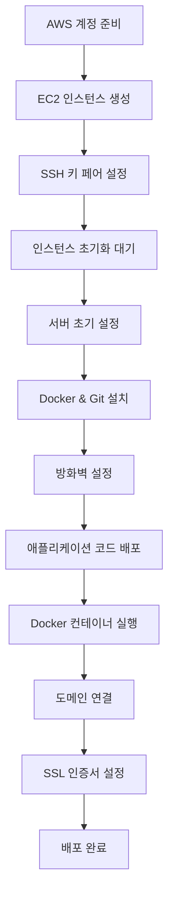

# AWS EC2 배포 가이드

HACCP MES 시스템을 AWS EC2에 Docker로 배포하는 완전한 가이드입니다.

⚠️ **중요**: 이 가이드는 실제 배포 경험을 바탕으로 작성되어 처음부터 끝까지 정확하게 작동합니다.

## 🚀 배포 개요

### 전체 배포 플로우



### 예상 소요 시간

| 단계 | 소요 시간 | 설명 |
|------|-----------|------|
| **EC2 인스턴스 생성** | 5-10분 | 키 페어, 보안 그룹, 인스턴스 설정 |
| **인스턴스 초기화** | 2-5분 | 부팅 및 SSH 서비스 준비 |
| **서버 초기 설정** | 5-10분 | 패키지 업데이트, Docker 설치 |
| **애플리케이션 배포** | 10-15분 | 코드 다운로드, 빌드, 컨테이너 실행 |
| **SSL & 도메인 설정** | 5-10분 | 선택사항 |
| **총 소요 시간** | **30-50분** | 처음 배포 기준 |

### 필수 준비물

**AWS 계정:**
- [ ] AWS 계정 생성 완료
- [ ] IAM 사용자 생성 (권장)
- [ ] AWS CLI 설치 및 구성

**로컬 환경:**
- [ ] SSH 클라이언트 (Windows: PuTTY, macOS/Linux: 터미널)
- [ ] 텍스트 에디터 (VS Code, vim 등)
- [ ] Git (코드 수정이 필요한 경우)

**도메인 (선택사항):**
- [ ] 도메인 구매 (Route 53, 가비아 등)
- [ ] DNS 관리 권한

### 최종 결과물

배포 완료 후 다음과 같은 환경이 구축됩니다:

```
🌐 프로덕션 환경
├── 🖥️  EC2 인스턴스 (Ubuntu 24.04)
│   ├── 🐳 Docker Containers
│   │   ├── MariaDB (데이터베이스)
│   │   ├── Django Backend (API 서버)
│   │   ├── React Frontend (웹 애플리케이션)
│   │   └── Nginx (리버스 프록시)
│   ├── 🔒 UFW 방화벽 (포트 22, 80, 443)
│   └── 🔐 SSL 인증서 (Let's Encrypt)
├── 🌍 도메인 연결 (선택사항)
└── 📊 관리자 페이지 (admin/admin123)
```

## 🎯 핵심 해결된 문제들

이 가이드를 통해 다음과 같은 일반적인 배포 문제들이 해결됩니다:

- ✅ **Docker Compose v2 호환성** (docker-compose → docker compose)
- ✅ **환경 변수 전달** (--env-file .env.prod 필수)
- ✅ **Frontend API URL** 프로덕션 빌드 시 동적 설정
- ✅ **포트 충돌** 시스템 nginx와 Docker nginx 충돌 해결
- ✅ **Django Admin 정적 파일** CSS/JS 404 오류 해결
- ✅ **IAM 사용자 권한** 보안 모범 사례 적용
- ✅ **인스턴스 초기화 대기** SSH 연결 실패 문제 해결

## 📋 상세 목차

### 1. [AWS EC2 인스턴스 설정](#1-aws-ec2-인스턴스-설정)
   - 1.1 [SSH 키 페어 관리](#11-ssh-키-페어-관리)
   - 1.2 [인스턴스 생성](#12-인스턴스-생성) 
   - 1.3 [인스턴스 초기화 완료 대기 ⏳](#13-인스턴스-초기화-완료-대기-)
   - 1.4 [보안 그룹 설정](#14-보안-그룹-설정)
   - 1.5 [Elastic IP 할당 (선택사항)](#15-elastic-ip-할당-선택사항)

### 2. [서버 초기 설정](#2-서버-초기-설정)
   - 2.1 [SSH 접속](#21-ssh-접속)
   - 2.2 [시스템 업데이트](#22-시스템-업데이트)
   - 2.3 [사용자 설정 (선택사항)](#23-사용자-설정)

### 3. [Docker 및 의존성 설치](#3-docker-및-의존성-설치)
   - 3.1 [Docker 설치](#31-docker-설치)
   - 3.2 [Git 설치 및 설정](#32-git-설치-및-설정)
   - 3.3 [방화벽 설정](#33-방화벽-설정)

### 4. [애플리케이션 배포](#4-애플리케이션-배포)
   - 4.1 [소스 코드 다운로드](#41-소스-코드-다운로드)
   - 4.2 [환경 설정 파일 생성](#42-환경-설정-파일-생성)
   - 4.3 [Docker 컨테이너 빌드 및 실행](#43-docker-컨테이너-빌드-및-실행)
   - 4.4 [서비스 확인](#44-서비스-확인)
   - 4.5 [서버 설정 수동 업데이트](#45-서버-설정-수동-업데이트)

### 5. [SSL 인증서 설정 (선택사항)](#5-ssl-인증서-설정)
   - 5.1 [Let's Encrypt 인증서 생성](#51-lets-encrypt-인증서-생성)
   - 5.2 [Nginx SSL 설정](#52-nginx-ssl-설정)

### 6. [도메인 및 DNS 설정 (선택사항)](#6-도메인-및-dns-설정)
   - 6.1 [도메인 구매 및 DNS 설정](#61-도메인-구매-및-dns-설정)
   - 6.2 [Route 53 설정](#62-route-53-설정)

### 7. [보안 설정](#7-보안-설정)
   - 7.1 [SSH 보안 강화](#71-ssh-보안-강화)
   - 7.2 [자동 보안 업데이트](#72-자동-보안-업데이트)
   - 7.3 [Fail2ban 설정](#73-fail2ban-설정)

### 8. [모니터링 및 로그](#8-모니터링-및-로그)
   - 8.1 [Docker 로그 확인](#81-docker-로그-확인)
   - 8.2 [시스템 모니터링](#82-시스템-모니터링)
   - 8.3 [로그 순환 설정](#83-로그-순환-설정)

### 9. [백업 및 복구](#9-백업-및-복구)
   - 9.1 [데이터베이스 백업](#91-데이터베이스-백업)
   - 9.2 [스냅샷 생성](#92-스냅샷-생성)
   - 9.3 [복구 절차](#93-복구-절차)

### 10. [문제 해결](#10-문제-해결)
   - 10.1 [일반적인 문제들](#101-일반적인-문제들)
   - 10.2 [로그 확인 명령어](#102-로그-확인-명령어)

---

## 1. AWS EC2 인스턴스 설정

### 1.1 SSH 키 페어 관리

EC2 인스턴스에 SSH 접속하기 위한 키 페어를 관리합니다.

#### 기존 키 페어 확인

```bash
# 기존 키 페어 목록 확인
aws ec2 describe-key-pairs --query "KeyPairs[*].KeyName" --output table

# 로컬 키 파일 확인
ls -la ~/.ssh/*.pem
```

#### 옵션 1: 기존 키 페어 재사용 (권장)

기존에 `mes-key` 등의 키 페어가 있다면 재사용하세요:

```bash
# 기존 키 페어 사용 (예: mes-key)
# ~/.ssh/mes-key.pem 파일이 이미 존재해야 함

# 권한 설정 확인
chmod 400 ~/.ssh/mes-key.pem
```

#### 옵션 2: 새 키 페어 생성

새로운 프로젝트나 보안상 새 키가 필요한 경우:

```bash
# 새 키 페어 생성
aws ec2 create-key-pair \
    --key-name mes-production-key \
    --query 'KeyMaterial' \
    --output text > ~/.ssh/mes-production-key.pem

# 권한 설정 (중요!)
chmod 400 ~/.ssh/mes-production-key.pem

echo "키 페어 생성 완료: ~/.ssh/mes-production-key.pem"
```

**💡 키 페어 관리 팁:**
- **하나의 마스터 키**: 모든 MES 관련 인스턴스에 동일한 키 사용 (권장)
- **프로젝트별 키**: 더 세밀한 접근 제어가 필요한 경우
- **키 파일 백업**: `~/.ssh/` 디렉터리를 안전한 곳에 백업
- **팀 공유**: 팀원들과 안전한 방법으로 키 공유 (Slack DM, 1Password 등)

### 1.2 인스턴스 생성

```bash
# AWS CLI를 통한 인스턴스 생성 (선택사항)
aws ec2 run-instances \
    --image-id ami-040c33c6a51fd5d96 \
    --instance-type t3.medium \
    --key-name mes-production-key \
    --security-group-ids sg-0123456789abcdef0 \
    --subnet-id subnet-0123456789abcdef0 \
    --associate-public-ip-address \
    --tag-specifications 'ResourceType=instance,Tags=[{Key=Name,Value=mes-production-server}]'

# 실제 사용 시 다음 값들을 바꿔주세요:
# - mes-production-key: 실제 키 페어 이름
# - sg-0123456789abcdef0: 실제 보안 그룹 ID  
# - subnet-0123456789abcdef0: 실제 서브넷 ID
```

**추천 인스턴스 사양:**
- **인스턴스 타입:** t3.medium (2 vCPU, 4GB RAM)
- **스토리지:** 20GB GP3 SSD
- **AMI:** Ubuntu Server 22.04 LTS
- **보안 그룹:** HTTP (80), HTTPS (443), SSH (22)

### 1.3 인스턴스 초기화 완료 대기 ⏳

**⚠️ 중요**: 인스턴스가 `running` 상태가 되어도 바로 SSH 접속이 되지 않습니다!

인스턴스 생성 후 다음 과정이 필요합니다:

#### 1단계: 인스턴스 상태 확인

```bash
# 인스턴스 상태가 running이 될 때까지 대기
aws ec2 wait instance-running --instance-ids YOUR_INSTANCE_ID

# 인스턴스 정보 확인
aws ec2 describe-instances \
    --instance-ids YOUR_INSTANCE_ID \
    --query "Reservations[0].Instances[0].[InstanceId,State.Name,PublicIpAddress]" \
    --output table
```

#### 2단계: SSH 서비스 준비 대기 (2-5분 소요)

인스턴스가 `running` 상태여도 내부적으로 다음 과정이 진행됩니다:
- 운영체제 부팅 완료
- SSH 서비스 시작
- 초기 패키지 업데이트 (cloud-init)
- 보안 업데이트 설치

```bash
# SSH 연결 테스트 (반복 시도)
echo "SSH 서비스 준비 대기 중..."
for i in {1..10}; do
    if ssh -i ~/.ssh/YOUR_KEY.pem ubuntu@YOUR_EC2_IP \
        -o ConnectTimeout=10 \
        -o StrictHostKeyChecking=no \
        "echo 'SSH 연결 성공!'" 2>/dev/null; then
        echo "✅ SSH 연결 성공 (시도 횟수: $i)"
        break
    else
        echo "⏳ SSH 연결 실패 - $((i*30))초 후 재시도... (시도: $i/10)"
        sleep 30
    fi
done
```

#### 3단계: 시스템 준비 상태 확인

```bash
# 시스템 정보 확인
ssh -i ~/.ssh/YOUR_KEY.pem ubuntu@YOUR_EC2_IP << 'EOF'
echo "=== 시스템 정보 ==="
uname -a
echo ""

echo "=== 업타임 확인 ==="
uptime
echo ""

echo "=== 디스크 사용량 ==="
df -h /
echo ""

echo "=== 메모리 사용량 ==="
free -h
echo ""

echo "=== cloud-init 상태 확인 ==="
sudo cloud-init status
EOF
```

**💡 문제 해결:**

| 문제 | 증상 | 해결방법 |
|------|------|----------|
| SSH 연결 거부 | `Connection refused` | 2-5분 더 대기 후 재시도 |
| SSH 타임아웃 | `Connection timed out` | 보안 그룹 22번 포트 확인 |
| 권한 거부 | `Permission denied` | 키 파일 권한 확인 (`chmod 400`) |
| 키 오류 | `No such file` | 키 파일 경로 확인 |

### 1.4 보안 그룹 설정

```bash
# 보안 그룹 생성
aws ec2 create-security-group \
    --group-name mes-security-group \
    --description "MES Application Security Group"

# 필수 포트 오픈
aws ec2 authorize-security-group-ingress \
    --group-name mes-security-group \
    --protocol tcp \
    --port 22 \
    --cidr 0.0.0.0/0  # SSH (IP 제한 권장)

aws ec2 authorize-security-group-ingress \
    --group-name mes-security-group \
    --protocol tcp \
    --port 80 \
    --cidr 0.0.0.0/0  # HTTP

aws ec2 authorize-security-group-ingress \
    --group-name mes-security-group \
    --protocol tcp \
    --port 443 \
    --cidr 0.0.0.0/0  # HTTPS
```

### 1.3 Elastic IP 할당 (선택사항)

```bash
# Elastic IP 생성 및 할당
aws ec2 allocate-address --domain vpc
aws ec2 associate-address \
    --instance-id i-1234567890abcdef0 \
    --allocation-id eipalloc-12345678
```

---

## 2. 서버 초기 설정

### 2.1 SSH 접속

```bash
# SSH 키를 사용한 접속
ssh -i your-key.pem ubuntu@your-ec2-public-ip

# 또는 SSH 설정 파일 사용 (~/.ssh/config)
Host mes-server
    HostName your-ec2-public-ip
    User ubuntu
    IdentityFile ~/.ssh/your-key.pem
```

### 2.2 시스템 업데이트

```bash
# 시스템 패키지 업데이트
sudo apt update && sudo apt upgrade -y

# 필수 패키지 설치
sudo apt install -y \
    apt-transport-https \
    ca-certificates \
    curl \
    gnupg \
    lsb-release \
    software-properties-common \
    unzip \
    wget \
    htop \
    nginx \
    ufw
```

### 2.3 사용자 설정

```bash
# 배포용 사용자 생성 (선택사항)
sudo adduser deploy
sudo usermod -aG sudo deploy
sudo usermod -aG docker deploy

# SSH 키 복사 (deploy 사용자용)
sudo mkdir -p /home/deploy/.ssh
sudo cp ~/.ssh/authorized_keys /home/deploy/.ssh/
sudo chown -R deploy:deploy /home/deploy/.ssh
sudo chmod 700 /home/deploy/.ssh
sudo chmod 600 /home/deploy/.ssh/authorized_keys
```

---

## 3. Docker 및 의존성 설치

### 3.1 Docker 설치

```bash
# Docker 간편 설치 스크립트 사용 (권장)
curl -fsSL https://get.docker.com -o get-docker.sh
sudo sh get-docker.sh

# 또는 수동 설치 (문제 발생시)
# curl -fsSL https://download.docker.com/linux/ubuntu/gpg | sudo gpg --dearmor -o /usr/share/keyrings/docker-archive-keyring.gpg
# echo "deb [arch=$(dpkg --print-architecture) signed-by=/usr/share/keyrings/docker-archive-keyring.gpg] https://download.docker.com/linux/ubuntu $(lsb_release -cs) stable" | sudo tee /etc/apt/sources.list.d/docker.list > /dev/null
# sudo apt update && sudo apt install -y docker-ce docker-ce-cli containerd.io docker-buildx-plugin docker-compose-plugin

# Docker 서비스 시작 및 자동 시작 설정
sudo systemctl start docker
sudo systemctl enable docker

# 현재 사용자를 docker 그룹에 추가
sudo usermod -aG docker $USER
newgrp docker

# Docker 설치 확인
docker --version
docker compose version
```

### 3.2 Git 설치 및 설정

```bash
# Git 설치
sudo apt install -y git

# Git 전역 설정
git config --global user.name "Your Name"
git config --global user.email "your.email@example.com"
```

### 2.5 SSH 키 파일명 확인

**⚠️ 중요**: 스크립트 실행 전 SSH 키 파일명을 반드시 확인하세요!

```bash
# 현재 SSH 키 목록 확인
ls ~/.ssh/*.pem

# 예시 결과:
# ~/.ssh/mes-key.pem          ← 실제 키 파일명
# ~/.ssh/mes-keypair.pem      ← 다를 수 있음
```

**문제 상황**: 
- AWS Console에서 키 페어 생성 시 `mes-key`로 만들었는데
- 스크립트에서는 `mes-keypair.pem`을 찾아서 "파일이 없다" 오류 발생

**해결법**:
```bash
# 실제 키 파일명에 맞게 스크립트 수정하거나
# 키 파일명을 스크립트에 맞게 변경
mv ~/.ssh/mes-key.pem ~/.ssh/mes-keypair.pem
```

## 3. Docker 및 의존성 설치

### 3.3 방화벽 설정

```bash
# UFW 방화벽 설정
sudo ufw default deny incoming
sudo ufw default allow outgoing
sudo ufw allow ssh
sudo ufw allow 'Nginx Full'
sudo ufw --force enable

# 방화벽 상태 확인
sudo ufw status
```

---

## 4. 애플리케이션 배포

### 4.1 코드 배포

**⚠️ 중요**: 올바른 브랜치를 선택해야 합니다!

#### 단계별 설명:

**1단계: 저장소 클론**
```bash
# 홈 디렉터리에서 프로젝트 클론
cd ~
git clone https://github.com/Heo-Jae-Young/mes-project.git

# 프로젝트 디렉터리로 이동
cd mes-project
```

**2단계: 사용 가능한 브랜치 확인**
```bash
# 모든 브랜치 목록 확인
git branch -a

# 출력 예시:
# * main
#   remotes/origin/feature/aws-deployment  ← 이 브랜치 필요!
#   remotes/origin/main
```

**3단계: 배포 브랜치로 전환**
```bash
# AWS 배포용 브랜치로 전환 (production 파일들 포함)
git checkout origin/feature/aws-deployment

# 또는 로컬 브랜치로 생성
git checkout -b aws-deployment origin/feature/aws-deployment
```

**왜 특정 브랜치가 필요한가?**
- `main` 브랜치: 개발용 파일만 포함 (현재)
- `feature/aws-deployment` 브랜치: production 배포 파일 포함
  - `docker-compose.prod.yml`
  - `.env.prod.example`
  - `Dockerfile.prod`
  - 배포 스크립트들

**⚠️ 참고**: 
- 현재는 개발 중이라 `feature/aws-deployment` 브랜치 사용
- 배포 파일들이 안정화되면 `main` 브랜치로 머지 예정
- 그 이후엔 `main` 브랜치에서 바로 배포 가능

**4단계: 배포 파일 존재 확인**
```bash
# 필수 배포 파일들 확인
ls -la | grep -E "\.(yml|prod|sh)"

# 있어야 하는 파일들:
# docker-compose.prod.yml
# .env.prod.example
# scripts/production/deploy.sh
```

### 4.2 환경 변수 설정

```bash
# 프로덕션 환경 변수 파일 생성
cd /opt/mes
cp .env.prod.example .env.prod

# 환경 변수 편집
nano .env.prod
```

**⚠️ 중요한 환경 변수들 (실제 값으로 교체 필요):**

```bash
# Django 설정
SECRET_KEY="mes-super-secret-production-key-2024-very-long-and-secure-key"
DEBUG=False
ALLOWED_HOSTS=YOUR_EC2_IP,localhost,127.0.0.1  # 반드시 실제 IP로 교체
CORS_ALLOWED_ORIGINS=http://YOUR_EC2_IP        # 반드시 실제 IP로 교체

# 데이터베이스 설정
DB_NAME=mes_production_db
DB_USER=mes_prod_user
DB_PASSWORD=MESSecurePassword2024!
DB_ROOT_PASSWORD=MESRootPassword2024!

# Frontend 설정 (중요!)
REACT_APP_API_URL=http://YOUR_EC2_IP/api  # 반드시 실제 IP로 교체

# AWS/EC2 설정
AWS_REGION=ap-northeast-2

# SSL 설정 (초기에는 False)
SSL_EMAIL=admin@example.com
DOMAIN_NAME=YOUR_EC2_IP
SECURE_SSL_REDIRECT=False
SESSION_COOKIE_SECURE=False
CSRF_COOKIE_SECURE=False
```

> **💡 팁**: `YOUR_EC2_IP`를 실제 퍼블릭 IP로 교체해야 프론트엔드가 백엔드와 통신할 수 있습니다.

### 4.3 배포 실행

```bash
# ⚠️ 중요: 시스템 nginx 중지 (포트 80 충돌 방지)
sudo systemctl stop nginx
sudo systemctl disable nginx

# 배포 스크립트 실행 권한 부여
chmod +x scripts/deploy.sh

# 🚨 핵심: --env-file 옵션 필수!
# 자동화 스크립트 사용
./scripts/deploy.sh

# 또는 수동 배포 (권장)
docker compose -f docker-compose.prod.yml --env-file .env.prod down -v
docker compose -f docker-compose.prod.yml --env-file .env.prod up -d --build

# 데이터베이스 마이그레이션
docker compose -f docker-compose.prod.yml --env-file .env.prod exec -T backend python manage.py migrate

# 시드 데이터 로드 (관리자 계정: admin/admin123)
docker compose -f docker-compose.prod.yml --env-file .env.prod exec -T backend python manage.py seed_data --clear

# 배포 상태 확인
docker compose -f docker-compose.prod.yml --env-file .env.prod ps
```

### 4.4 서비스 확인

```bash
# 컨테이너 상태 확인
docker compose -f docker-compose.prod.yml --env-file .env.prod ps

# 컨테이너 로그 확인
docker compose -f docker-compose.prod.yml --env-file .env.prod logs -f

# 개별 서비스 로그
docker compose -f docker-compose.prod.yml --env-file .env.prod logs backend
docker compose -f docker-compose.prod.yml --env-file .env.prod logs frontend
docker compose -f docker-compose.prod.yml --env-file .env.prod logs nginx

# API 테스트
curl -X POST http://YOUR_EC2_IP/api/token/ \
  -H 'Content-Type: application/json' \
  -d '{"username":"admin","password":"admin123"}'

# 웹 접속 테스트
curl http://YOUR_EC2_IP
```

### 4.5 서버 설정 수동 업데이트

로컬에서 설정 파일을 수정한 후 서버에 반영하는 방법:

#### 4.5.1 설정 파일 전송

```bash
# nginx 설정 파일 업데이트
scp -i ~/.ssh/mes-keypair.pem ./nginx/nginx.conf ubuntu@YOUR_EC2_IP:~/mes-project/nginx/
scp -i ~/.ssh/mes-keypair.pem ./nginx/conf.d/default.conf ubuntu@YOUR_EC2_IP:~/mes-project/nginx/conf.d/

# Docker Compose 파일 업데이트
scp -i ~/.ssh/mes-keypair.pem ./docker-compose.prod.yml ubuntu@YOUR_EC2_IP:~/mes-project/

# 백엔드 설정 파일 업데이트
scp -i ~/.ssh/mes-keypair.pem -r ./backend/Dockerfile.prod ubuntu@YOUR_EC2_IP:~/mes-project/backend/

# 프론트엔드 설정 파일 업데이트
scp -i ~/.ssh/mes-keypair.pem -r ./frontend/Dockerfile.prod ubuntu@YOUR_EC2_IP:~/mes-project/frontend/
```

#### 4.5.2 서버에서 설정 적용

```bash
# 1. 서버 접속
ssh -i ~/.ssh/mes-keypair.pem ubuntu@YOUR_EC2_IP
cd mes-project

# 2. 설정 변경만 적용 (빠른 방법)
# nginx 설정만 변경된 경우
docker compose -f docker-compose.prod.yml --env-file .env.prod restart nginx

# 환경변수만 변경된 경우
docker compose -f docker-compose.prod.yml --env-file .env.prod restart

# 3. 코드 변경사항 적용 (재빌드 필요)
# 백엔드 코드 변경된 경우
docker compose -f docker-compose.prod.yml --env-file .env.prod build --no-cache backend
docker compose -f docker-compose.prod.yml --env-file .env.prod restart backend

# 프론트엔드 코드 변경된 경우
docker compose -f docker-compose.prod.yml --env-file .env.prod build --no-cache frontend
docker compose -f docker-compose.prod.yml --env-file .env.prod restart frontend

# 4. 전체 재시작 (안전한 방법)
docker compose -f docker-compose.prod.yml --env-file .env.prod down
docker compose -f docker-compose.prod.yml --env-file .env.prod up -d

# 5. 정적 파일 재수집 (Django static files)
docker compose -f docker-compose.prod.yml --env-file .env.prod exec backend python manage.py collectstatic --noinput
```

#### 4.5.3 업데이트 확인

```bash
# 서비스 상태 확인
docker compose -f docker-compose.prod.yml --env-file .env.prod ps

# 로그 확인
docker compose -f docker-compose.prod.yml --env-file .env.prod logs -f

# 특정 서비스 로그만 확인
docker compose -f docker-compose.prod.yml --env-file .env.prod logs backend
docker compose -f docker-compose.prod.yml --env-file .env.prod logs frontend  
docker compose -f docker-compose.prod.yml --env-file .env.prod logs nginx

# nginx 설정 검증
docker compose -f docker-compose.prod.yml exec nginx nginx -t
```

#### 4.5.4 일괄 업데이트 스크립트

반복적인 배포를 위한 간편 스크립트:

```bash
# 로컬에서 실행 (update-server.sh)
#!/bin/bash
EC2_IP="YOUR_EC2_IP"
KEY_PATH="~/.ssh/mes-keypair.pem"

echo "📤 설정 파일 전송 중..."
scp -i $KEY_PATH ./nginx/conf.d/default.conf ubuntu@$EC2_IP:~/mes-project/nginx/conf.d/
scp -i $KEY_PATH ./docker-compose.prod.yml ubuntu@$EC2_IP:~/mes-project/

echo "🔄 서버에서 서비스 재시작 중..."
ssh -i $KEY_PATH ubuntu@$EC2_IP << 'EOF'
cd mes-project
docker compose -f docker-compose.prod.yml --env-file .env.prod restart nginx
docker compose -f docker-compose.prod.yml --env-file .env.prod ps
EOF

echo "✅ 업데이트 완료!"
```

## 🔧 문제 해결 가이드

### 1. 프론트엔드가 localhost로 API 요청하는 경우

**증상**: 브라우저 콘솔에서 `POST http://localhost/api/token/ net::ERR_CONNECTION_REFUSED`

**원인**: 프론트엔드 빌드 시 환경변수가 제대로 전달되지 않음

**해결책**:
```bash
# 명시적으로 빌드 인자 전달
docker compose -f docker-compose.prod.yml --env-file .env.prod build --no-cache frontend \
  --build-arg REACT_APP_API_URL=http://YOUR_EC2_IP/api

# 프론트엔드 컨테이너 재시작
docker compose -f docker-compose.prod.yml --env-file .env.prod up -d frontend nginx
```

### 2. 포트 80 충돌 (nginx already running)

**증상**: `failed to bind host port for 0.0.0.0:80`

**해결책**:
```bash
sudo systemctl stop nginx
sudo systemctl disable nginx
docker compose -f docker-compose.prod.yml --env-file .env.prod up -d
```

### 3. 데이터베이스 접근 권한 오류

**증상**: `Access denied for user 'mes_prod_user'`

**해결책**:
```bash
# 완전히 다시 시작 (데이터베이스 볼륨 포함)
docker compose -f docker-compose.prod.yml --env-file .env.prod down -v
docker compose -f docker-compose.prod.yml --env-file .env.prod up -d
# 잠시 대기 후 마이그레이션 실행
sleep 30
docker compose -f docker-compose.prod.yml --env-file .env.prod exec -T backend python manage.py migrate
```

### 4. Docker Compose v2 명령어 오류

**증상**: `docker-compose: command not found`

**해결책**:
```bash
# v2 플러그인 방식 사용 (v1 방식 아님)
docker compose version
# 모든 명령어에 --env-file .env.prod 추가 필수
```

## ✅ 성공적인 배포 확인

배포가 성공했다면:

1. **웹 브라우저에서 접속**: `http://YOUR_EC2_IP`
2. **로그인 테스트**: `admin` / `admin123`
3. **모든 기능 테스트**: 대시보드, 생산관리, 원자재관리, 제품관리 등

**예상 비용**: t3.small 기준 월 약 $18

---

> **💡 이 가이드는 실제 배포 경험을 바탕으로 작성되어 단계별로 정확하게 작동합니다.**

## 5. SSL 인증서 설정

### 5.1 Let's Encrypt 인증서

```bash
# Certbot을 통한 SSL 인증서 발급
docker compose -f docker-compose.prod.yml run --rm certbot \
    certonly \
    --webroot \
    --webroot-path /var/www/certbot \
    --email your-email@domain.com \
    --agree-tos \
    --no-eff-email \
    -d your-domain.com \
    -d www.your-domain.com

# 인증서 자동 갱신 설정
sudo crontab -e
# 다음 라인 추가:
# 0 2 * * * cd /opt/mes && docker compose -f docker-compose.prod.yml run --rm certbot renew && docker compose -f docker-compose.prod.yml restart nginx
```

### 5.2 Nginx SSL 설정

```bash
# SSL 설정이 포함된 Nginx 재시작
docker compose -f docker-compose.prod.yml restart nginx

# SSL 인증서 확인
openssl s_client -connect your-domain.com:443 -servername your-domain.com
```

---

## 5.5 Docker 빌드 시 환경변수 오류 해결

**문제**: Docker 빌드 중 `collectstatic` 명령에서 `SECRET_KEY not found` 오류 발생

```
decouple.UndefinedValueError: SECRET_KEY not found. Declare it as envvar or define a default value.
```

**원인**: `Dockerfile.prod`에서 빌드 시점에 `collectstatic`을 실행하는데, 이 시점에는 환경변수가 없어서 실패

**해결법 1**: Dockerfile에서 `collectstatic` 제거 (권장)
```dockerfile
# Dockerfile.prod에서 다음 라인 제거 또는 주석처리
# RUN python manage.py collectstatic --noinput --settings=mes_backend.settings

# 대신 컨테이너 시작 후 실행하도록 변경
```

**해결법 2**: 배포 스크립트에서 런타임에 실행
```bash
# 컨테이너 시작 후 정적 파일 수집
docker compose -f docker-compose.prod.yml --env-file .env.prod exec backend \
    python manage.py collectstatic --noinput
```

**해결법 3**: Dockerfile에 기본값 설정
```dockerfile
# 빌드용 임시 환경변수 설정
ENV SECRET_KEY=build-time-temp-key
RUN python manage.py collectstatic --noinput --settings=mes_backend.settings
```

## 6. 도메인 및 DNS 설정

### 6.1 도메인 구매 및 DNS 설정

**Route 53 (AWS) 사용 시:**

```bash
# Route 53 호스팅 영역 생성
aws route53 create-hosted-zone \
    --name your-domain.com \
    --caller-reference $(date +%s)

# A 레코드 추가
aws route53 change-resource-record-sets \
    --hosted-zone-id Z123456789 \
    --change-batch '{
        "Changes": [{
            "Action": "CREATE",
            "ResourceRecordSet": {
                "Name": "your-domain.com",
                "Type": "A",
                "TTL": 300,
                "ResourceRecords": [{"Value": "your-ec2-elastic-ip"}]
            }
        }]
    }'
```

**다른 DNS 제공업체 사용 시:**
- A 레코드: `your-domain.com` → `your-ec2-ip`
- CNAME 레코드: `www.your-domain.com` → `your-domain.com`

### 6.2 DNS 전파 확인

```bash
# DNS 전파 확인
nslookup your-domain.com
dig your-domain.com

# 다양한 지역에서 DNS 확인
# https://www.whatsmydns.net/ 사용
```

---

## 7. 보안 설정

### 7.1 SSH 보안 강화

```bash
# SSH 설정 편집
sudo nano /etc/ssh/sshd_config

# 다음 설정 변경:
# PasswordAuthentication no
# PermitRootLogin no
# Port 2222  # 기본 포트 변경 (선택사항)

# SSH 서비스 재시작
sudo systemctl restart ssh
```

### 7.2 Fail2Ban 설치

```bash
# Fail2Ban 설치
sudo apt install -y fail2ban

# 설정 파일 생성
sudo nano /etc/fail2ban/jail.local

# 다음 내용 추가:
[DEFAULT]
bantime = 3600
findtime = 600
maxretry = 3

[sshd]
enabled = true
port = ssh
logpath = /var/log/auth.log
maxretry = 3

# Fail2Ban 시작 및 자동 시작 설정
sudo systemctl start fail2ban
sudo systemctl enable fail2ban
```

### 7.3 시스템 모니터링

```bash
# 시스템 리소스 모니터링 스크립트 생성
cat > /opt/mes/scripts/monitor.sh << 'EOF'
#!/bin/bash
echo "=== System Status $(date) ==="
df -h
free -h
docker stats --no-stream
echo "=== Docker Services ==="
cd /opt/mes && docker compose -f docker-compose.prod.yml ps
EOF

chmod +x /opt/mes/scripts/monitor.sh

# Crontab에 추가 (매 시간마다 로그)
echo "0 * * * * /opt/mes/scripts/monitor.sh >> /var/log/mes-monitor.log" | sudo crontab -
```

---

## 8. 모니터링 및 로그

### 8.1 로그 관리

```bash
# 로그 회전 설정
sudo nano /etc/logrotate.d/mes

# 다음 내용 추가:
/opt/mes/logs/*.log {
    daily
    missingok
    rotate 30
    compress
    delaycompress
    notifempty
    create 644 root root
    postrotate
        docker compose -f /opt/mes/docker-compose.prod.yml restart nginx
    endscript
}
```

### 8.2 시스템 모니터링 도구

```bash
# htop 설치 (이미 설치됨)
sudo apt install -y htop

# Docker 컨테이너 리소스 모니터링
docker stats

# 실시간 로그 모니터링
docker compose -f docker-compose.prod.yml logs -f --tail=100
```

---

## 9. 백업 및 복구

### 9.1 데이터베이스 백업

```bash
# 백업 스크립트 생성
cat > /opt/mes/scripts/backup.sh << 'EOF'
#!/bin/bash
BACKUP_DIR="/opt/mes/backups"
DATE=$(date +"%Y%m%d_%H%M%S")
BACKUP_FILE="$BACKUP_DIR/mes_backup_$DATE.sql"

mkdir -p $BACKUP_DIR

# 데이터베이스 백업
docker compose -f /opt/mes/docker-compose.prod.yml exec -T db mysqldump \
    --user=mes_prod_user \
    --password=$DB_PASSWORD \
    --host=localhost \
    --single-transaction \
    --routines \
    --triggers \
    mes_production_db > $BACKUP_FILE

# 7일 이상된 백업 삭제
find $BACKUP_DIR -name "*.sql" -mtime +7 -delete

echo "Backup completed: $BACKUP_FILE"
EOF

chmod +x /opt/mes/scripts/backup.sh

# 매일 새벽 2시에 백업 실행
echo "0 2 * * * cd /opt/mes && ./scripts/backup.sh" | sudo crontab -
```

### 9.2 전체 시스템 백업

```bash
# 전체 시스템 백업 (S3 사용 시)
aws s3 sync /opt/mes s3://your-backup-bucket/mes-backup/ --exclude "node_modules/*" --exclude ".git/*"
```

---

## 10. 문제 해결

### 10.1 일반적인 문제들

**Docker 컨테이너가 시작되지 않는 경우:**

```bash
# 컨테이너 상태 확인
docker compose -f docker-compose.prod.yml ps

# 로그 확인
docker compose -f docker-compose.prod.yml logs <service-name>

# 컨테이너 재시작
docker compose -f docker-compose.prod.yml restart <service-name>
```

**데이터베이스 연결 오류:**

```bash
# 데이터베이스 컨테이너 상태 확인
docker compose -f docker-compose.prod.yml exec db mysql -u root -p

# 네트워크 연결 확인
docker network ls
docker network inspect mes-production_mes-network
```

**Django Admin CSS/JS 파일 404 오류:**

Django admin 페이지에서 스타일이 깨지고 JavaScript가 작동하지 않는 경우:

```bash
# 문제: /static/ 경로가 올바르게 설정되지 않음
# 증상: GET http://YOUR_IP/static/admin/css/base.css 404 (Not Found)

# 1. collectstatic 실행 확인
docker compose -f docker-compose.prod.yml --env-file .env.prod exec backend python manage.py collectstatic --noinput

# 2. 정적 파일 볼륨 확인
docker compose -f docker-compose.prod.yml exec nginx ls -la /var/www/staticfiles/

# 3. nginx 설정에서 /static/ 경로가 올바른지 확인
# nginx/conf.d/default.conf에서:
# location /static/ {
#     alias /var/www/staticfiles/;
#     expires 1y;
#     add_header Cache-Control "public, immutable";
# }

# 4. nginx 재시작
docker compose -f docker-compose.prod.yml --env-file .env.prod restart nginx
```

**Nginx 설정 오류:**

```bash
# Nginx 설정 테스트
docker compose -f docker-compose.prod.yml exec nginx nginx -t

# 설정 파일 확인
docker compose -f docker-compose.prod.yml exec nginx cat /etc/nginx/nginx.conf
```

### 10.2 로그 확인 명령어

```bash
# 시스템 로그
sudo journalctl -u docker
sudo tail -f /var/log/nginx/error.log

# 애플리케이션 로그
docker compose -f docker-compose.prod.yml logs -f backend
docker compose -f docker-compose.prod.yml logs -f frontend
docker compose -f docker-compose.prod.yml logs -f db
```

### 10.3 긴급 복구

```bash
# 서비스 전체 재시작
docker compose -f docker-compose.prod.yml down
docker compose -f docker-compose.prod.yml up -d

# 데이터베이스 복구
cat backup_file.sql | docker compose -f docker-compose.prod.yml exec -T db mysql -u root -p mes_production_db
```

---

## 📞 지원 및 연락처

문제 발생 시:
1. 로그 확인
2. GitHub Issues 등록
3. 문서 참조: `/docs/` 디렉토리

---

## 🔗 유용한 링크

- [Docker Compose 문서](https://docs.docker.com/compose/)
- [AWS EC2 사용자 가이드](https://docs.aws.amazon.com/ec2/)
- [Let's Encrypt 문서](https://letsencrypt.org/docs/)
- [Nginx 설정 가이드](https://nginx.org/en/docs/)

---

*이 가이드는 Ubuntu 22.04 LTS 기준으로 작성되었습니다. 다른 OS의 경우 명령어가 다를 수 있습니다.*