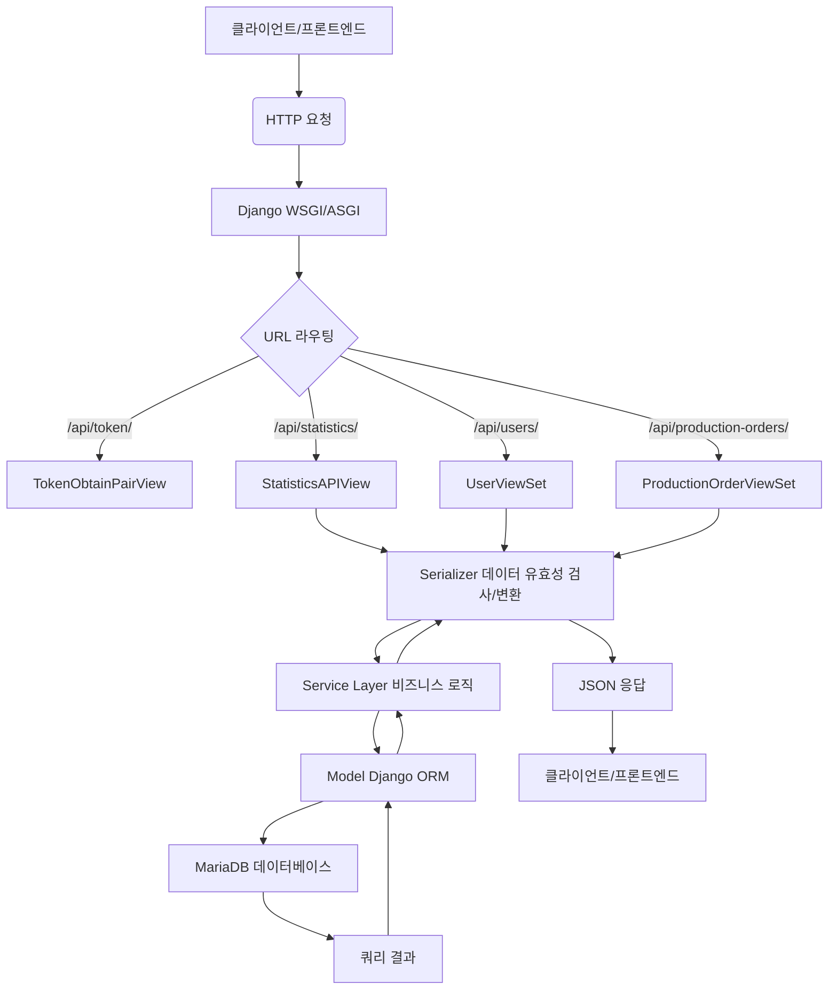
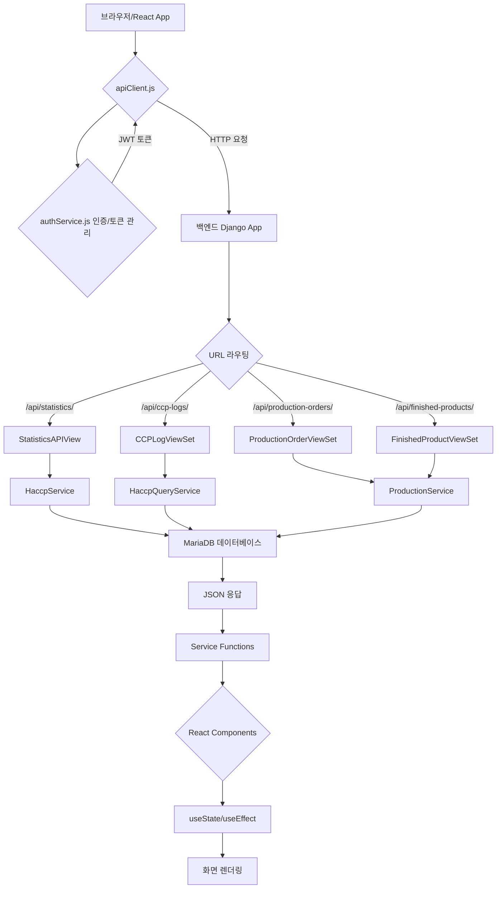
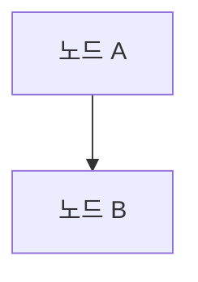
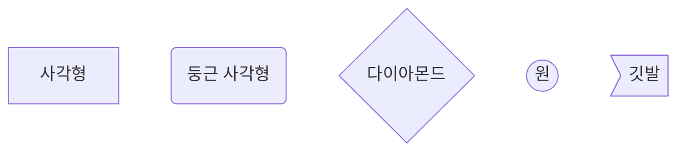
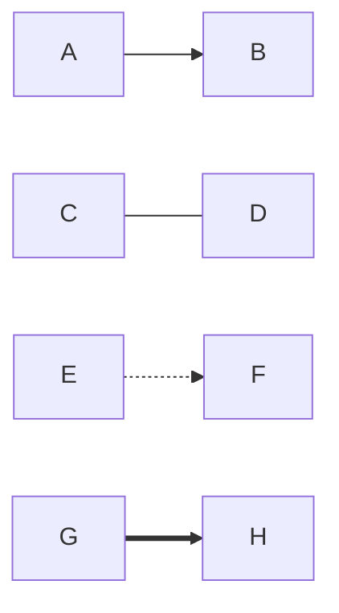
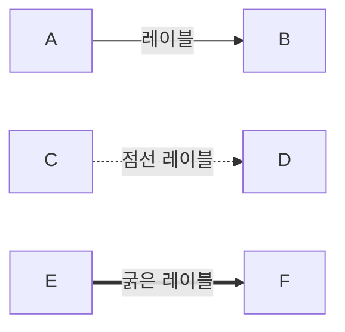
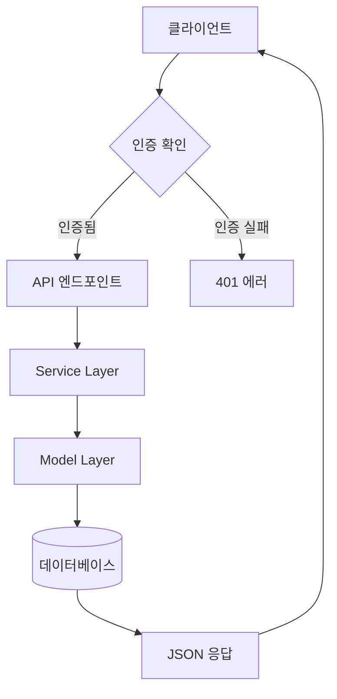

# 시스템 데이터 플로우 (System Data Flow)

이 문서는 HACCP MES 프로젝트의 전체 데이터 흐름을 설명합니다. 백엔드와 프론트엔드에서 데이터가 어떻게 처리되고 전달되는지, 그리고 사용된 Mermaid 다이어그램 문법을 함께 다룹니다.

## 📋 목차

1. [백엔드 데이터 플로우](#1-백엔드-데이터-플로우)
   - [1.1 전체 데이터 흐름 개요](#11-전체-데이터-흐름-개요)
   - [1.2 각 계층별 상세 설명](#12-각-계층별-상세-설명)
   - [1.3 구체적인 API 요청 예시](#13-구체적인-api-요청-예시)

2. [프론트엔드 데이터 플로우](#2-프론트엔드-데이터-플로우)
   - [2.1 전체 데이터 흐름 개요](#21-전체-데이터-흐름-개요)
   - [2.2 파일별 역할과 데이터 처리](#22-파일별-역할과-데이터-처리)
   - [2.3 실제 사용 예시](#23-실제-사용-예시)

3. [부록: Mermaid 문법 가이드](#3-부록-mermaid-문법-가이드)
   - [3.1 기본 구조](#31-기본-구조)
   - [3.2 노드와 연결선](#32-노드와-연결선)
   - [3.3 실무 팁](#33-실무-팁)

---

## 1. 백엔드 데이터 플로우

이 섹션은 Django REST Framework 기반의 백엔드 애플리케이션에서 HTTP 요청이 들어왔을 때, 데이터가 어떤 아키텍처 구성 요소를 거쳐 처리되고 데이터베이스에 접근하는지 그 과정을 상세하게 설명합니다.

### 1.1 전체 데이터 흐름 개요

백엔드에서 HTTP 요청은 다음과 같은 주요 단계를 거쳐 처리됩니다.



### 1.2 각 계층별 상세 설명

#### 1.2.1 HTTP 요청 수신 (WSGI/ASGI)

Django는 웹 서버와 Python 애플리케이션 사이의 표준 인터페이스인 WSGI(Web Server Gateway Interface)를 통해 HTTP 요청을 받습니다.

- **개발 환경**: Django의 내장 개발 서버 (`python manage.py runserver`)
- **프로덕션 환경**: Nginx + Gunicorn 또는 uWSGI 조합

#### 1.2.2 URL 라우팅 (`urls.py`)

들어온 HTTP 요청의 URL 경로를 분석해서 어떤 View가 처리할지 결정합니다.

```python
# backend/config/urls.py
urlpatterns = [
    path('admin/', admin.site.urls),
    path('api/', include('core.urls')),
]

# backend/core/urls.py  
router = DefaultRouter()
router.register(r'users', UserViewSet)
router.register(r'ccps', CCPViewSet)
router.register(r'ccp-logs', CCPLogViewSet)
```

#### 1.2.3 View 계층 (`views.py`)

HTTP 요청을 직접 받고 HTTP 응답을 반환하는 계층입니다. 하지만 실제 비즈니스 로직은 Service Layer에 위임합니다.

**주요 역할:**
- HTTP 요청 파라미터 파싱
- 권한 검사 (Permission Classes)
- Service Layer 호출
- HTTP 응답 생성 (성공/실패 상태 코드 포함)

#### 1.2.4 Serializer 계층 (`serializers.py`)

Model 객체와 JSON 데이터 간의 변환을 담당하며, 데이터 유효성 검증도 수행합니다.

**주요 역할:**
- 입력 데이터 유효성 검증 (validation)
- Model → JSON 직렬화 (serialization)
- JSON → Model 역직렬화 (deserialization)

#### 1.2.5 Service Layer (`services.py`)

실제 비즈니스 로직이 구현되는 계층입니다. View를 얇게 유지하고 복잡한 로직을 중앙 관리합니다.

**주요 역할:**
- 복잡한 비즈니스 규칙 실행
- 여러 Model을 조합한 로직
- 외부 시스템 연동 (필요시)
- 트랜잭션 관리

#### 1.2.6 Model 계층 (`models.py`)

데이터베이스 테이블과 매핑되는 Django ORM 모델입니다.

**주요 역할:**
- 데이터베이스 스키마 정의
- 기본 CRUD 연산 제공
- 관계(Relationship) 정의
- 데이터 제약조건 정의

#### 1.2.7 데이터베이스 (MariaDB)

실제 데이터가 저장되고 조회되는 계층입니다.

### 1.3 구체적인 API 요청 예시

#### 예시 1: CCP 로그 생성 요청

```
POST /api/ccp-logs/
{
  "ccp_id": "uuid-of-ccp",
  "measured_value": 75.5,
  "unit": "°C",
  "measured_at": "2025-09-01T14:30:00Z"
}
```

**처리 흐름:**
1. **URL 라우팅**: `/api/ccp-logs/` → `CCPLogViewSet.create()`
2. **View**: `CCPLogViewSet.create()` 메소드 실행
3. **Serializer**: `CCPLogCreateSerializer`로 데이터 유효성 검증
4. **Service**: `HaccpService.validate_ccp_log_creation()` 비즈니스 로직 실행
5. **Model**: `CCPLog.objects.create()` 데이터베이스 저장
6. **응답**: JSON 형태로 생성된 객체 반환

#### 예시 2: 통계 데이터 조회 요청

```
GET /api/statistics/
```

**처리 흐름:**
1. **URL 라우팅**: `/api/statistics/` → `StatisticsAPIView.get()`
2. **View**: `StatisticsAPIView.get()` 메소드 실행
3. **Service**: 여러 Service 메소드를 조합하여 통계 계산
   - `HaccpService.calculate_compliance_score()`
   - `ProductionService.get_production_summary()`
4. **Model**: 여러 모델에서 데이터 조회 및 집계
5. **응답**: 계산된 통계 데이터 JSON 반환

#### 예시 3: 원자재 목록 조회 (재고 정보 포함)

```
GET /api/raw-materials/?category=ingredient&is_active=true
```

**처리 흐름:**
1. **URL 라우팅**: `/api/raw-materials/` → `RawMaterialViewSet.list()`
2. **View**: 필터 파라미터 처리 및 Serializer 선택
3. **Serializer**: `RawMaterialSerializer.get_inventory_info()` 메소드 실행
4. **ORM 최적화**: 
   ```python
   # 단일 쿼리로 재고 정보 집계
   active_lots = obj.lots.filter(
       status__in=['received', 'in_storage', 'in_use'],
       quantity_current__gt=0
   )
   total_quantity = active_lots.aggregate(total=Sum('quantity_current'))['total']
   ```
5. **응답**: 원자재 정보 + 재고 집계 데이터 JSON 반환

#### 예시 4: 로트 소비 처리

```
POST /api/material-lots/{lot_id}/consume/
{
  "quantity": "50.5"
}
```

**처리 흐름:**
1. **URL 라우팅**: `/api/material-lots/{id}/consume/` → `MaterialLotViewSet.consume()`
2. **View**: 커스텀 액션 메소드 실행
3. **타입 안전성 보장**:
   ```python
   from decimal import Decimal
   consume_quantity = Decimal(str(request.data.get('quantity', 0)))
   ```
4. **비즈니스 규칙 검증**: 수량 초과 확인, 상태 유효성 체크
5. **Model**: 수량 차감 및 상태 업데이트
6. **응답**: 업데이트된 로트 정보 반환

---

## 2. 프론트엔드 데이터 플로우

이 섹션은 HACCP MES 프로젝트에서 백엔드 데이터가 프론트엔드 화면에 어떻게 요청되고, 전달되며, 최종적으로 사용자에게 시각화되는지 그 과정을 파일별로 상세하게 설명합니다.

### 2.1 전체 데이터 흐름 개요

데이터는 다음과 같은 주요 단계를 거쳐 흐릅니다.



### 2.2 파일별 역할과 데이터 처리

#### 2.2.1 API 클라이언트 계층

**`services/apiClient.js`**
- Axios 기반의 HTTP 클라이언트 설정
- 기본 URL, 타임아웃, 인터셉터 설정
- 모든 API 호출의 공통 진입점

```javascript
import axios from 'axios';

const apiClient = axios.create({
  baseURL: process.env.REACT_APP_API_URL || 'http://localhost:8000/api',
  timeout: 10000,
  headers: {
    'Content-Type': 'application/json',
  }
});
```

**`services/authService.js`**
- JWT 토큰 관리 (저장, 갱신, 삭제)
- 로그인/로그아웃 API 호출
- 사용자 정보 조회

#### 2.2.2 도메인별 서비스 계층

**`services/ccpService.js`**
- CCP(Critical Control Point) 관련 모든 API 호출
- CCP 목록 조회, CCP 로그 생성/조회 등

**`services/productionService.js` (구현 완료)**
- 생산 주문 관리 전용 API 클라이언트
- CRUD 작업: getProductionOrders(), createProductionOrder(), updateProductionOrder()
- 생산 제어: startProduction(), completeProduction(), pauseProduction(), resumeProduction()
- 완제품 목록: getFinishedProducts() - 생산 폼 드롭다운용
- 대시보드 데이터: getProductionDashboard(), getUpcomingOrders()

**향후 추가 예정:**
- `services/complianceService.js`: 컴플라이언스 리포트 API

#### 2.2.3 상태 관리 계층

**`context/AuthContext.js`**
- 사용자 인증 상태 전역 관리
- 로그인/로그아웃 함수 제공
- 토큰 자동 갱신 로직

#### 2.2.4 컴포넌트 계층

**페이지 컴포넌트 (`pages/`)**
- `DashboardPage.js`: 대시보드 통계 데이터 표시
- `CCPLogsPage.js`: CCP 로그 관리 페이지
- `ProductionPage.js`: 생산 주문 관리 메인 페이지 (구현 완료)

**생산 관리 컴포넌트 (`components/` - 구현 완료)**
- `forms/ProductionOrderForm.js`: 생산 주문 생성/수정 폼 (react-hook-form + 유효성 검증)
- `lists/ProductionOrderList.js`: 생산 주문 목록 + 상태별 액션 버튼
- `production/ProductionControls.js`: 생산 제어 패널 (시작/완료/일시정지/재개)

**공통 컴포넌트 (`components/`)**
- `forms/CCPLogForm.js`: CCP 로그 입력 폼
- `lists/CCPLogList.js`: CCP 로그 목록 표시
- `layout/Header.js`: 네비게이션 헤더

**유틸리티 (`utils/` - 구현 완료)**
- `dateFormatter.js`: date-fns 기반 일관된 날짜 처리

### 2.3 실제 사용 예시

#### 예시 1: 대시보드 통계 데이터 로딩

```javascript
// pages/DashboardPage.js
const DashboardPage = () => {
  const [stats, setStats] = useState(null);
  
  useEffect(() => {
    const fetchStats = async () => {
      try {
        // 1. apiClient를 통해 백엔드 API 호출
        const response = await apiClient.get('/statistics/');
        // 2. 응답 데이터를 상태에 저장
        setStats(response.data);
      } catch (error) {
        console.error('통계 데이터 조회 실패:', error);
      }
    };
    
    fetchStats();
  }, []);
  
  // 3. 상태 데이터를 UI로 렌더링
  return (
    <div>
      <h1>HACCP 준수율: {stats?.compliance_rate}%</h1>
    </div>
  );
};
```

#### 예시 2: CCP 로그 입력

```javascript
// components/forms/CCPLogForm.js
const CCPLogForm = () => {
  const [formData, setFormData] = useState({
    ccp_id: '',
    measured_value: '',
    unit: '',
    measured_at: new Date().toISOString()
  });
  
  const handleSubmit = async (e) => {
    e.preventDefault();
    
    try {
      // 1. ccpService를 통해 API 호출
      await ccpService.createCCPLog({
        ccp_id: formData.ccp_id,
        measured_value: parseFloat(formData.measured_value),
        unit: formData.unit,
        measured_at: formData.measured_at
      });
      
      // 2. 성공 시 사용자 피드백
      toast.success('CCP 로그가 저장되었습니다.');
      
      // 3. 폼 초기화
      setFormData({ /* 초기값 */ });
      
    } catch (error) {
      // 4. 에러 처리
      toast.error('저장 중 오류가 발생했습니다.');
    }
  };
  
  return (
    <form onSubmit={handleSubmit}>
      {/* 폼 UI */}
    </form>
  );
};
```

#### 예시 3: 생산 주문 관리 (react-hook-form + 검증)

```javascript
// components/forms/ProductionOrderForm.js
const ProductionOrderForm = ({ onClose, onSubmit, initialData = null }) => {
  const {
    register,
    handleSubmit,
    formState: { errors, isSubmitting },
    setValue,
    watch
  } = useForm({
    defaultValues: {
      order_number: '',
      finished_product_id: '',
      planned_quantity: '',
      planned_start_date: getCurrentDateTimeLocal(),
      planned_end_date: (() => {
        const tomorrow = new Date();
        tomorrow.setDate(tomorrow.getDate() + 1);
        return tomorrow.toISOString().slice(0, 16);
      })(),
      priority: 'normal'
    }
  });

  const [products, setProducts] = useState([]);

  // 1. 완제품 목록 API 호출 (드롭다운용)
  useEffect(() => {
    const loadProducts = async () => {
      try {
        const productsData = await productionService.getFinishedProducts();
        setProducts(productsData.results || productsData);
      } catch (error) {
        console.error('제품 목록 로드 실패:', error);
      }
    };
    loadProducts();
  }, []);

  const onSubmitForm = async (data) => {
    const submitData = {
      ...data,
      planned_quantity: parseInt(data.planned_quantity),
      planned_start_date: toISOString(data.planned_start_date),
      planned_end_date: toISOString(data.planned_end_date)
    };

    // 2. 생산 주문 생성 API 호출
    await onSubmit(submitData);
  };

  return (
    <form onSubmit={handleSubmit(onSubmitForm)}>
      {/* react-hook-form으로 관리되는 폼 필드들 */}
      <select {...register('finished_product_id', { required: '제품을 선택해주세요' })}>
        <option value="">제품을 선택하세요</option>
        {products.map((product) => (
          <option key={product.id} value={product.id}>
            {product.code} - {product.name}
          </option>
        ))}
      </select>
    </form>
  );
};
```

#### 예시 4: 생산 시작 처리 (Service Layer 연동)

```javascript
// pages/ProductionPage.js
const ProductionPage = () => {
  const [orders, setOrders] = useState([]);

  // 생산 시작 처리
  const handleStartProduction = async (orderId) => {
    try {
      // 1. productionService를 통해 백엔드 API 호출
      await productionService.startProduction(orderId);
      
      // 2. 성공 시 사용자 피드백
      toast.success('생산이 시작되었습니다');
      
      // 3. 목록 새로고침 (상태 변경 반영)
      fetchOrders();
    } catch (error) {
      // 4. 백엔드에서 전달된 에러 메시지 표시
      toast.error(error.response?.data?.detail || '생산 시작에 실패했습니다');
    }
  };

  // 백엔드 ProductionService.start_production()이 호출되어
  // FIFO 기반 원자재 할당 + 상태 전환이 자동으로 처리됨
};
```

#### 예시 5: 원자재 관리 - 재고 집계 최적화 패턴

```javascript
// ❌ 비효율적인 방법: 프론트엔드에서 집계
// MaterialsPage.js (이전 버전)
const loadInventoryData = async (materialsList) => {
  // 1. 모든 로트 데이터를 가져옴 (N+1 쿼리 문제)
  const lotsResponse = await materialService.getAllMaterialLots();
  
  // 2. 프론트엔드에서 집계 처리 (성능 저하)
  materialsList.forEach(material => {
    const materialLots = allLots.filter(lot => lot.raw_material === material.id);
    const totalQuantity = materialLots.reduce((sum, lot) => sum + lot.quantity_current, 0);
    // ... 복잡한 집계 로직
  });
};

// ✅ 최적화된 방법: 백엔드에서 집계
// MaterialsPage.js (최적화 버전)
const fetchMaterials = async () => {
  // 1. 원자재 목록과 재고 정보를 한번에 가져옴
  const data = await materialService.getMaterials(filters);
  const materialsList = data.results || data;
  
  // 2. 백엔드에서 미리 계산된 재고 정보 사용
  const inventorySummary = {};
  materialsList.forEach(material => {
    if (material.inventory_info) {
      inventorySummary[material.id] = material.inventory_info;
    }
  });
  
  // 백엔드 RawMaterialSerializer.get_inventory_info()에서
  // Django ORM aggregate()로 DB 레벨 집계 처리됨
};
```

#### 예시 6: 로트 소비 처리 - Decimal 타입 안전성

```javascript
// MaterialDetailPage.js에서 로트 소비
const handleConsumeLot = async (lotId, quantity) => {
  try {
    // 1. 프론트엔드에서 입력값 전송
    await materialService.consumeMaterialLot(lotId, { quantity });
    
    // 2. 백엔드에서 Decimal 타입 변환 처리
    // MaterialLotViewSet.consume()에서 자동으로
    // Decimal(str(request.data.get('quantity', 0))) 변환
    
    toast.success('로트 소비 처리가 완료되었습니다.');
    loadLots(); // 3. 목록 새로고침
  } catch (error) {
    // 4. 비즈니스 규칙 위반 시 에러 처리
    toast.error(error.response?.data?.detail || '소비 처리에 실패했습니다.');
  }
};
```

#### 예시 7: 인증이 필요한 API 호출

```javascript
// services/authService.js에서 토큰 관리
// apiClient.js에서 인터셉터로 자동 토큰 첨부

apiClient.interceptors.request.use(
  (config) => {
    const token = localStorage.getItem('accessToken');
    if (token) {
      config.headers.Authorization = `Bearer ${token}`;
    }
    return config;
  },
  (error) => Promise.reject(error)
);
```

---

## 3. 부록: Mermaid 문법 가이드

이 섹션은 Mermaid 다이어그램을 Markdown 파일 내에서 작성하기 위한 기본적인 문법과 유의사항을 정리합니다.

### 3.1 기본 구조

모든 Mermaid 다이어그램은 `graph` 키워드로 시작하며, 다이어그램의 방향을 지정합니다.



-   `graph TD`: Top-Down (위에서 아래로)
-   `graph LR`: Left-Right (왼쪽에서 오른쪽으로)

### 3.2 노드와 연결선

#### 3.2.1 노드 (Nodes)

노드는 다이어그램의 각 단계를 나타냅니다. 다양한 모양을 가질 수 있습니다.



#### 3.2.2 연결선 (Links)

노드들을 연결하는 선에도 다양한 스타일을 적용할 수 있습니다.



- `A --> B`: 화살표
- `C --- D`: 직선
- `E -.-> F`: 점선 화살표  
- `G ==> H`: 굵은 화살표

#### 3.2.3 텍스트가 있는 연결선



### 3.3 실무 팁

#### 3.3.1 한글 사용 시 주의사항

- 노드 이름에 한글 사용 가능
- 연결선 레이블에도 한글 사용 가능
- 특수문자 사용 시 따옴표로 감싸기: `A["특수문자 (포함)"]`

#### 3.3.2 복잡한 다이어그램 작성 팁

1. **단계별 작성**: 먼저 주요 노드만 배치하고 점진적으로 세부사항 추가
2. **일관된 명명**: 노드 ID는 의미있게 작성 (A, B, C보다는 USER, API, DB 등)
3. **적절한 방향 선택**: 데이터 흐름은 TD, 프로세스 흐름은 LR이 적합

#### 3.3.3 실제 프로젝트에서 사용 예시



이렇게 Mermaid를 활용하면 복잡한 시스템의 데이터 플로우를 직관적으로 표현할 수 있습니다.