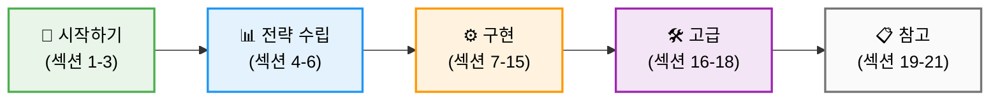
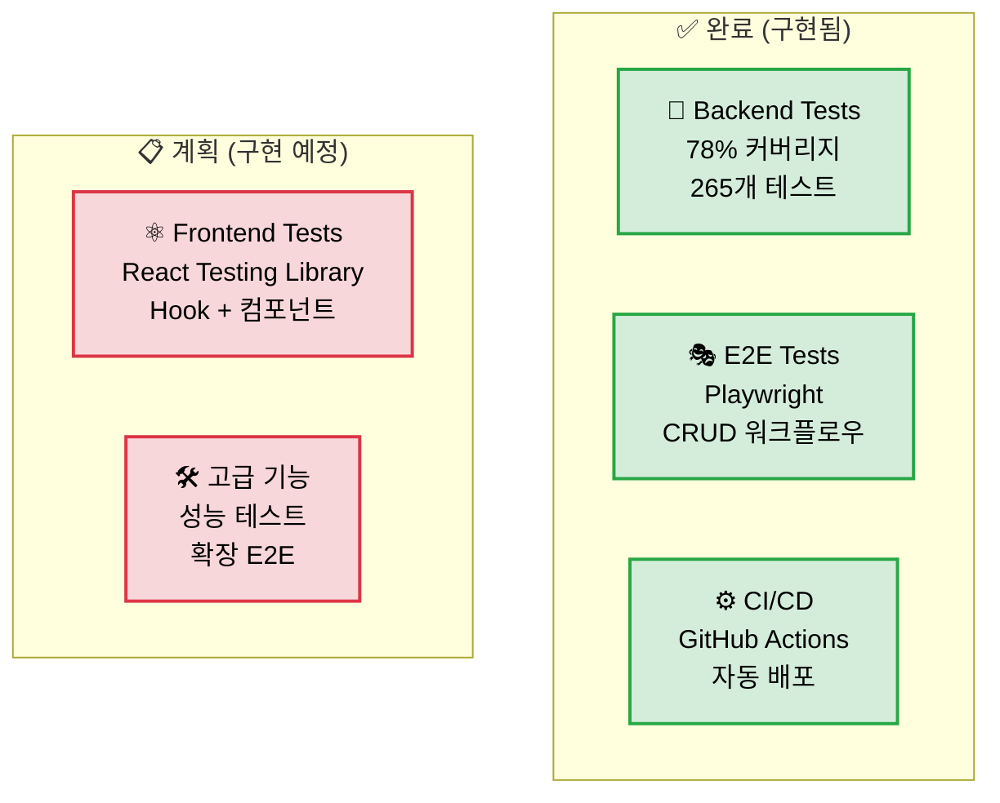
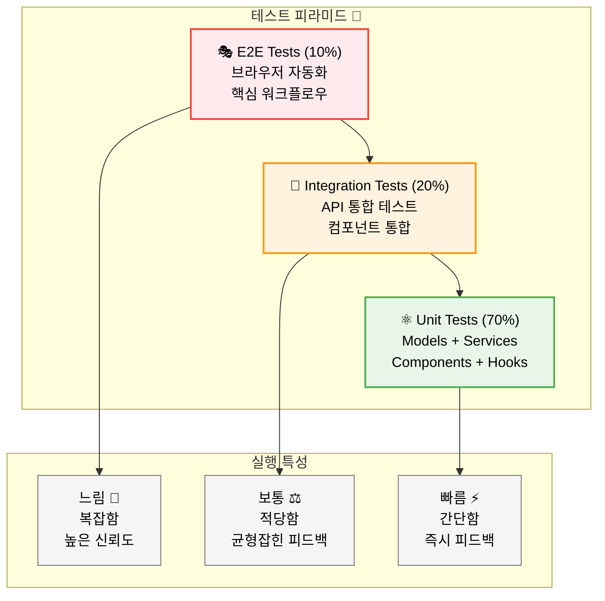
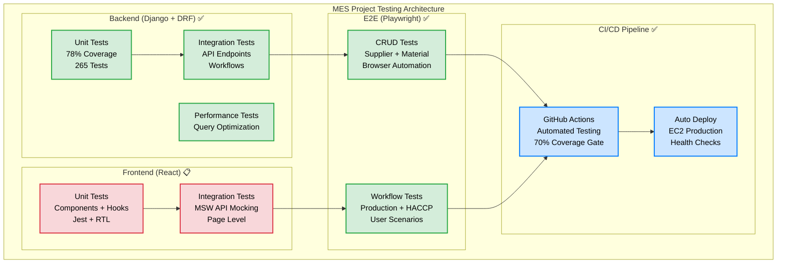
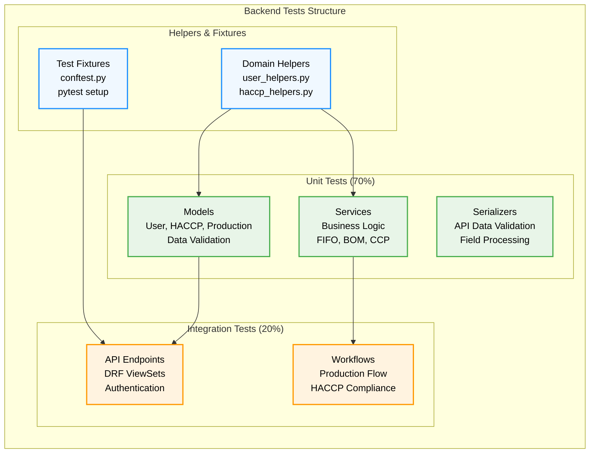
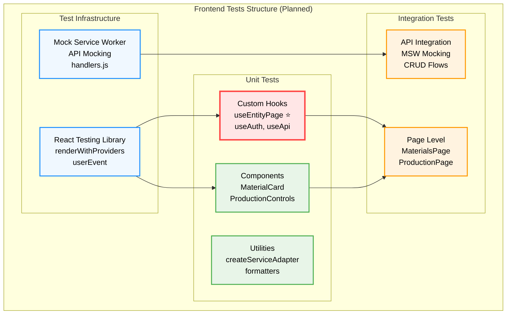
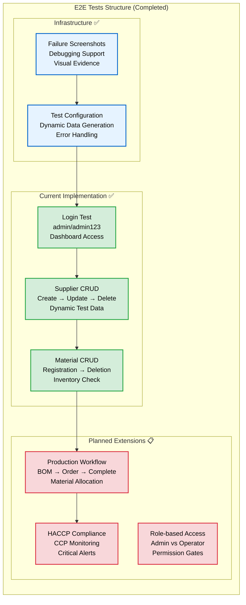
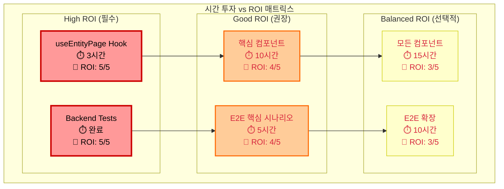
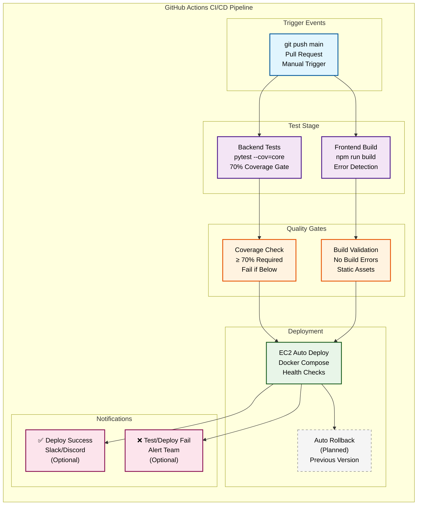

# 🧪 HACCP MES 프로젝트 통합 테스팅 가이드

> **"한 권으로 마스터하는 풀스택 테스트 전략"**
>
> 백엔드부터 프론트엔드, E2E까지 전체 테스트 생태계를 다루는 완전 가이드.
> Django + React + Playwright 기반 실무 중심 테스트 아키텍처.

---

## 📚 **목차 (Table of Contents)**

### 📖 **가이드 구성**



### 🏗️ **구현 상태**



### 🏃‍♂️ **시작하기 (Quick Start)**

- [1. 5분 만에 전체 테스트 실행해보기](#-1-5분-만에-전체-테스트-실행해보기)
- [2. 테스트 전략 개요](#-2-테스트-전략-개요)
- [3. 테스트가 왜 중요한가?](#-3-테스트가-왜-중요한가)

### 📖 **테스트 아키텍처**

- [4. 테스트 피라미드와 전략](#-4-테스트-피라미드와-전략)
- [5. 프로젝트별 테스트 구조](#-5-프로젝트별-테스트-구조)
- [6. 시간 투자 대비 효과 분석](#-6-시간-투자-대비-효과-분석)

### 🔧 **백엔드 테스트 (Django + DRF)**

- [7. Django 단위 테스트](#-7-django-단위-테스트)
- [8. Service Layer 테스트](#-8-service-layer-테스트)
- [9. API 통합 테스트](#-9-api-통합-테스트)

### ⚛️ **프론트엔드 테스트 (React)**

- [10. React 컴포넌트 테스트](#-10-react-컴포넌트-테스트)
- [11. Custom Hook 테스트](#-11-custom-hook-테스트)
- [12. API 연동 테스트](#-12-api-연동-테스트)

### 🎭 **E2E 테스트 (Playwright)**

- [13. Playwright 브라우저 테스트](#-13-playwright-브라우저-테스트)
- [14. 사용자 시나리오 테스트](#-14-사용자-시나리오-테스트)
- [15. 브라우저 자동화 전략](#-15-브라우저-자동화-전략)

### 🛠️ **실무 활용 & 고급 테크닉**

- [16. CI/CD 테스트 파이프라인](#-16-cicd-테스트-파이프라인)
- [17. 테스트 데이터 관리](#-17-테스트-데이터-관리)
- [18. 성능 테스트 & 최적화](#-18-성능-테스트--최적화)

### 📋 **참고 자료**

- [19. 테스트 체크리스트](#-19-테스트-체크리스트)
- [20. 트러블슈팅 FAQ](#-20-트러블슈팅-faq)
- [21. 도구 & 라이브러리 가이드](#-21-도구--라이브러리-가이드)

---

## 🏃‍♂️ **1. 5분 만에 전체 테스트 실행해보기**

> **"테스트가 뭔지 몰라도 일단 돌려보자!"**

### 1.1 백엔드 테스트 실행

```bash
# 1. 백엔드 디렉토리로 이동
cd backend

# 2. 가상환경 활성화
source venv/bin/activate

# 3. 전체 테스트 실행
pytest -v

# 4. 커버리지 포함 실행
pytest --cov=core --cov-report=html
```

**현재 상황**: 78% 커버리지, 265개 테스트 통과 ✅

### 1.2 E2E 테스트 실행

```bash
# 1. E2E 테스트 디렉토리로 이동
cd e2e_tests

# 2. 의존성 설치 (최초 1회)
npm run install-playwright

# 3. 브라우저 테스트 실행
npm run test:crud

# 4. 백그라운드 실행 (빠름)
npm run test:crud-headless
```

**현재 상황**: CRUD 워크플로우 자동화 완료 ✅

### 1.3 프론트엔드 테스트 (계획됨)

```bash
# 1. 프론트엔드 디렉토리로 이동
cd frontend

# 2. 테스트 실행 (구현 예정)
npm test

# 3. 커버리지 포함 실행
npm test -- --coverage
```

**계획**: React Testing Library + Jest 기반 구축 예정

---

## 🚀 **2. 테스트 전략 개요**

### 2.1 현재 구축된 테스트 시스템

| 테스트 레벨              | 도구 스택            | 현재 상태 | 커버리지        |
| ------------------------ | -------------------- | --------- | --------------- |
| **Backend Unit**         | pytest + Django      | ✅ 완료   | 78% (265 tests) |
| **Backend Integration**  | pytest + DRF         | ✅ 완료   | 포함됨          |
| **E2E Browser**          | Playwright + Node.js | ✅ 완료   | CRUD 워크플로우 |
| **Frontend Unit**        | Jest + RTL           | 📋 계획됨 | 0%              |
| **Frontend Integration** | MSW + Jest           | 📋 계획됨 | 0%              |

### 2.2 우리 프로젝트 특화 테스트 포인트

#### 🛡️ **HACCP 규정 준수 검증**

- CCP 로그 불변성 보장
- 한계 기준 초과 자동 알림
- 추적성(Traceability) 완전성

#### 📦 **재고 관리 정확성**

- FIFO 원칙 준수 검증
- 동시성 상황 재고 업데이트
- 로트별 품질검사 상태 관리

#### 💰 **원가 계산 로직**

- BOM 기반 정확한 원가 산정
- FIFO 기반 원자재 가격 적용
- 실시간 가격 변동 반영

---

## 💡 **3. 테스트가 왜 중요한가?**

### 3.1 실제 발견한 버그 사례들

#### 🐛 **Case 1: 데이터베이스 제약조건 위반**

```python
# 문제 상황
employee_id = f'ROLE_PRODUCTION_MANAGER'  # 21자
# 하지만 DB 필드 max_length=20 😱

# 테스트로 미리 발견!
MySQLdb.DataError: (1406, "Data too long for column 'employee_id' at row 1")

# 해결책
employee_id = f'R_{role.upper()}'[:20]  # 20자 제한
```

#### 🐛 **Case 2: 브라우저 호환성 이슈**

```javascript
// 문제: 브라우저 스크롤 위치 문제
// E2E 테스트에서 요소가 화면에 보이지 않음

// 해결책: 고정 뷰포트 + 스크롤 처리
await page.setViewportSize({ width: 1920, height: 1080 });
await page.evaluate(() => window.scrollTo(0, document.body.scrollHeight));
```

### 3.2 테스트 ROI 분석

| 테스트 종류       | 초기 투자 시간 | 유지보수 시간 | 버그 방지 효과 | ROI       |
| ----------------- | -------------- | ------------- | -------------- | --------- |
| **Backend Unit**  | 20-30시간      | 2시간/월      | ⭐⭐⭐⭐⭐     | 매우 높음 |
| **E2E Core**      | 5-8시간        | 1시간/월      | ⭐⭐⭐⭐       | 높음      |
| **Frontend Unit** | 15-20시간      | 2시간/월      | ⭐⭐⭐⭐       | 높음      |
| **E2E Extended**  | 10-15시간      | 3시간/월      | ⭐⭐⭐         | 중간      |

---

## 📖 **4. 테스트 피라미드와 전략**

### 4.1 권장 테스트 분배 비율



### 4.2 우리 프로젝트 테스트 전략

#### 🟢 **Unit Tests (70%)** - 개발 중 빠른 피드백

```python
# Backend Examples
def test_fifo_material_consumption():
    """FIFO 원칙 원자재 소비 검증"""

def test_ccp_log_immutability():
    """CCP 로그 불변성 보장"""
```

```javascript
// Frontend Examples
test("useEntityPage manages CRUD state correctly", () => {
  // Custom hook 상태 관리 검증
});

test("MaterialCard displays inventory status", () => {
  // 컴포넌트 렌더링 검증
});
```

#### 🟡 **Integration Tests (20%)** - 컴포넌트 상호작용

```python
# API Integration
def test_production_order_creation_workflow():
    """생산 주문 생성 전체 API 플로우"""
```

```javascript
// Frontend Integration with MSW
test("Materials page CRUD operations", () => {
  // API 연동 포함 페이지 레벨 테스트
});
```

#### 🔴 **E2E Tests (10%)** - 핵심 비즈니스 시나리오

```javascript
// Playwright Browser Tests
test("Complete supplier management workflow", async () => {
  // 공급업체 등록 → 수정 → 삭제 전체 플로우
});
```

---

## 🏗️ **5. 프로젝트별 테스트 구조**

### 5.1 전체 테스트 아키텍처 개요



### 5.2 Backend 테스트 구조 (Django) - ✅ 완료



**디렉토리 구조:**

```
backend/core/tests/
├── conftest.py                   # pytest fixtures
├── helpers/                      # 도메인별 헬퍼 함수
│   ├── user_helpers.py          # ✅ 완료
│   ├── haccp_helpers.py         # ✅ 완료
│   ├── supplier_helpers.py      # ✅ 완료
│   └── production_helpers.py    # ✅ 완료
├── unit/                         # 단위 테스트 (78% 커버리지)
│   ├── models/                   # 모델 테스트
│   │   ├── test_user.py         # ✅ 완료
│   │   ├── test_haccp.py        # ✅ 완료
│   │   └── test_production.py   # ✅ 완료
│   ├── services/                 # 서비스 레이어 테스트
│   │   ├── test_user_service.py # ✅ 완료
│   │   ├── test_haccp_service.py # ✅ 완료
│   │   └── test_production_service.py # ✅ 완료
│   └── serializers/              # 시리얼라이저 테스트
│       ├── test_user_serializers.py # ✅ 완료
│       └── test_haccp_serializers.py # ✅ 완료
└── integration/                  # 통합 테스트
    ├── test_api_endpoints.py     # ✅ 완료
    └── test_workflows.py         # ✅ 완료
```

### 5.3 Frontend 테스트 구조 (React) - 📋 계획됨



**디렉토리 구조 (계획):**

```
frontend/src/tests/
├── __tests__/                    # 컴포넌트 테스트
│   ├── components/
│   │   ├── MaterialCard.test.jsx
│   │   ├── ProductionControls.test.jsx
│   │   └── SupplierForm.test.jsx
│   ├── pages/
│   │   ├── MaterialsPage.test.jsx
│   │   ├── ProductionPage.test.jsx
│   │   └── SuppliersPage.test.jsx
│   └── hooks/
│       ├── useEntityPage.test.js  # 🚨 최우선
│       ├── useAuth.test.js
│       └── useApi.test.js
├── mocks/                        # API 모킹 (MSW)
│   ├── handlers.js
│   └── server.js
├── utils/                        # 테스트 유틸리티
│   ├── renderWithProviders.js
│   └── createMockData.js
└── setupTests.js                 # Jest 설정
```

### 5.4 E2E 테스트 구조 (Playwright) - ✅ 완료



**디렉토리 구조:**

```
e2e_tests/
├── crud.spec.js                  # ✅ 메인 CRUD 테스트
├── package.json                  # 테스트 스크립트
├── README.md                     # 실행 가이드
└── screenshots/                  # 실패 시 스크린샷
```

---

## 💰 **6. 시간 투자 대비 효과 분석**

### 6.1 개발 단계별 투자 계획

#### 🚨 **Phase 1: 핵심 안정성 확보 (1-2주)**

```
투자 시간: 25-30시간
ROI: 매우 높음 - 배포 안정성 보장
```

**우선순위 작업:**

1. **useEntityPage Hook 테스트** (3시간) - 가장 중요한 재사용 로직
2. **핵심 컴포넌트 테스트** (10시간) - Materials, Production, Suppliers 페이지
3. **E2E 시나리오 확장** (5시간) - 생산 주문, CCP 로그 워크플로우
4. **API 연동 테스트** (7시간) - MSW 기반 통합 테스트

#### 🔧 **Phase 2: 완전한 커버리지 (3-4주)**

```
투자 시간: 20-25시간
ROI: 높음 - 장기 유지보수 효율성
```

**확장 작업:**

1. **모든 컴포넌트 테스트** (15시간)
2. **복잡한 비즈니스 로직 테스트** (10시간) - BOM 계산, 원가 산정

### 6.2 테스트별 가치 분석



| 테스트 영역              | 시간 투자 | 버그 방지 효과 | 개발 생산성 | 권장도       |
| ------------------------ | --------- | -------------- | ----------- | ------------ |
| **useEntityPage Hook**   | 3시간     | ⭐⭐⭐⭐⭐     | ⭐⭐⭐⭐⭐  | 🚨 필수      |
| **핵심 페이지 컴포넌트** | 10시간    | ⭐⭐⭐⭐       | ⭐⭐⭐⭐    | 🔥 강력 권장 |
| **E2E 핵심 시나리오**    | 5시간     | ⭐⭐⭐⭐       | ⭐⭐⭐      | 👍 권장      |
| **모든 컴포넌트**        | 15시간    | ⭐⭐⭐         | ⭐⭐⭐      | ⚖️ 균형적    |

### 6.3 최종 권장 전략

**🎯 최소 필수 구성 (15시간 투자)**

- useEntityPage Hook 테스트 ✅
- Materials/Production/Suppliers 페이지 테스트 ✅
- 핵심 E2E 시나리오 3-4개 ✅

**🏆 이상적 구성 (35시간 투자)**

- 위 + 모든 컴포넌트 테스트 ✅
- API 통합 테스트 (MSW) ✅
- 확장된 E2E 시나리오 ✅

---

## 🔧 **7. Django 단위 테스트**

### 7.1 현재 구축된 테스트 시스템 (78% 커버리지)

#### **Model Tests (265개 테스트 중 주요 부분)**

```python
# ✅ 완료된 핵심 모델 테스트
@pytest.mark.unit
class TestUserModel:
    def test_user_creation_with_role_validation(self):
        """사용자 생성 시 역할별 검증"""

    def test_employee_id_length_constraint(self):
        """실제 버그: employee_id 20자 제한"""

@pytest.mark.unit
class TestMaterialLotModel:
    def test_fifo_consumption_principle(self):
        """FIFO 원칙 원자재 소비"""

    def test_quality_inspection_status_flow(self):
        """품질검사 상태 플로우 검증"""

@pytest.mark.unit
class TestCCPLogModel:
    def test_immutable_audit_trail(self):
        """CCP 로그 불변성 - HACCP 규정"""

    def test_critical_limit_violation_detection(self):
        """한계 기준 초과 자동 감지"""
```

#### **Service Layer Tests (비즈니스 로직 핵심)**

```python
# ✅ 완료된 서비스 레이어 테스트
class TestProductionService:
    def test_material_availability_validation(self):
        """생산 시작 전 원자재 가용성 검증"""

    def test_bom_based_material_allocation(self):
        """BOM 기반 원자재 할당 정확성"""

class TestHaccpService:
    def test_compliance_score_calculation(self):
        """HACCP 컴플라이언스 점수 계산"""

    def test_ccp_monitoring_automation(self):
        """CCP 모니터링 자동화 로직"""
```

### 7.2 테스트 실행 방법

```bash
# 전체 백엔드 테스트
pytest backend -v

# 단위테스트만 실행
pytest backend -m "unit" -v

# 커버리지 리포트 생성
pytest backend --cov=core --cov-report=html

# 특정 도메인 테스트
pytest backend/core/tests/unit/models/test_user.py -v
pytest backend/core/tests/unit/services/test_haccp_service.py -v
```

### 7.3 실제 발견된 버그 사례

```python
# Bug Case: DB 제약조건 위반
def test_employee_id_max_length_constraint(self):
    """실제 버그: employee_id 20자 제한 vs ROLE_PRODUCTION_MANAGER 21자"""
    long_role = 'ROLE_PRODUCTION_MANAGER'  # 21자

    with pytest.raises(Exception):  # DB 제약조건 위반
        User.objects.create_user(
            username='test',
            password='pass123',
            employee_id=f'{long_role}'  # 20자 초과!
        )

# Fix: 적절한 길이 제한
def test_employee_id_proper_truncation(self):
    """해결책: 20자 제한 적용"""
    role = 'ROLE_PRODUCTION_MANAGER'
    user = User.objects.create_user(
        username='test',
        password='pass123',
        employee_id=f'R_{role.upper()}'[:20]  # 해결책!
    )
    assert len(user.employee_id) <= 20
```

---

## ⚛️ **10. React 컴포넌트 테스트**

### 10.1 테스트 환경 구축 (계획)

#### **패키지 설치**

```bash
cd frontend

# 테스트 라이브러리 설치
npm install --save-dev @testing-library/react @testing-library/jest-dom
npm install --save-dev @testing-library/user-event
npm install --save-dev msw  # API 모킹
```

#### **설정 파일**

```javascript
// src/setupTests.js
import "@testing-library/jest-dom";
import { server } from "./tests/mocks/server";

beforeAll(() => server.listen());
afterEach(() => server.resetHandlers());
afterAll(() => server.close());
```

### 10.2 useEntityPage Hook 테스트 (최우선)

```javascript
// src/tests/hooks/useEntityPage.test.js
import { renderHook, act } from "@testing-library/react";
import { useEntityPage } from "../../hooks/useEntityPage";
import { createServiceAdapter } from "../../utils/createServiceAdapter";

describe("useEntityPage Hook", () => {
  test("handles CRUD operations correctly", async () => {
    // Given: Mock service adapter
    const mockService = {
      getAll: jest.fn().mockResolvedValue({
        results: [{ id: 1, name: "Test Item" }],
        count: 1,
      }),
      create: jest.fn().mockResolvedValue({ id: 2, name: "New Item" }),
      update: jest.fn().mockResolvedValue({ id: 1, name: "Updated Item" }),
      delete: jest.fn().mockResolvedValue({}),
    };

    const serviceAdapter = createServiceAdapter(mockService);

    // When: Hook 초기화
    const { result } = renderHook(() => useEntityPage(serviceAdapter, "items"));

    // Then: 초기 상태 검증
    expect(result.current.loading).toBe(true);
    expect(result.current.items).toEqual([]);

    // When: 데이터 로드 완료 대기
    await act(async () => {
      await new Promise((resolve) => setTimeout(resolve, 0));
    });

    // Then: 로드된 데이터 검증
    expect(result.current.loading).toBe(false);
    expect(result.current.items).toHaveLength(1);
    expect(mockService.getAll).toHaveBeenCalled();
  });

  test("manages loading states properly", async () => {
    const mockService = {
      getAll: jest
        .fn()
        .mockImplementation(
          () =>
            new Promise((resolve) =>
              setTimeout(() => resolve({ results: [], count: 0 }), 100)
            )
        ),
    };

    const { result } = renderHook(() =>
      useEntityPage(createServiceAdapter(mockService), "items")
    );

    // 로딩 상태 확인
    expect(result.current.loading).toBe(true);

    await act(async () => {
      await new Promise((resolve) => setTimeout(resolve, 150));
    });

    expect(result.current.loading).toBe(false);
  });

  test("handles API errors gracefully", async () => {
    const mockService = {
      getAll: jest.fn().mockRejectedValue(new Error("Network error")),
    };

    const { result } = renderHook(() =>
      useEntityPage(createServiceAdapter(mockService), "items")
    );

    await act(async () => {
      await new Promise((resolve) => setTimeout(resolve, 0));
    });

    expect(result.current.error).toBeTruthy();
    expect(result.current.loading).toBe(false);
  });
});
```

### 10.3 핵심 컴포넌트 테스트

#### **MaterialCard 컴포넌트 테스트**

```javascript
// src/tests/components/MaterialCard.test.jsx
import { render, screen } from "@testing-library/react";
import MaterialCard from "../../components/MaterialCard";

describe("MaterialCard Component", () => {
  test("displays material information correctly", () => {
    const mockMaterial = {
      id: 1,
      name: "밀가루",
      code: "MAT001",
      current_stock: 100,
      unit: "kg",
      safety_stock: 50,
    };

    render(<MaterialCard material={mockMaterial} />);

    expect(screen.getByText("밀가루")).toBeInTheDocument();
    expect(screen.getByText("MAT001")).toBeInTheDocument();
    expect(screen.getByText("100 kg")).toBeInTheDocument();
  });

  test("shows low stock warning when below safety level", () => {
    const lowStockMaterial = {
      id: 1,
      name: "설탕",
      current_stock: 20, // 안전재고 미만
      safety_stock: 50,
    };

    render(<MaterialCard material={lowStockMaterial} />);

    expect(screen.getByText(/재고 부족/)).toBeInTheDocument();
    expect(screen.getByTestId("low-stock-warning")).toHaveClass("text-red-600");
  });
});
```

#### **ProductionControls 컴포넌트 테스트**

```javascript
// src/tests/components/ProductionControls.test.jsx
import { render, screen, fireEvent } from "@testing-library/react";
import userEvent from "@testing-library/user-event";
import ProductionControls from "../../components/ProductionControls";

describe("ProductionControls Component", () => {
  test("enables start button only when materials are available", () => {
    const mockOrder = {
      id: 1,
      status: "planned",
      product: { name: "빵" },
      required_materials: [
        { material: "밀가루", available: true },
        { material: "설탕", available: false }, // 하나라도 없으면 비활성화
      ],
    };

    const onStart = jest.fn();

    render(<ProductionControls order={mockOrder} onStart={onStart} />);

    const startButton = screen.getByRole("button", { name: /생산 시작/ });
    expect(startButton).toBeDisabled();
  });

  test("calls onStart when start button is clicked", async () => {
    const user = userEvent.setup();
    const mockOrder = {
      id: 1,
      status: "planned",
      required_materials: [
        { material: "밀가루", available: true },
        { material: "설탕", available: true },
      ],
    };

    const onStart = jest.fn();

    render(<ProductionControls order={mockOrder} onStart={onStart} />);

    const startButton = screen.getByRole("button", { name: /생산 시작/ });
    await user.click(startButton);

    expect(onStart).toHaveBeenCalledWith(1);
  });
});
```

---

## 🎭 **13. Playwright 브라우저 테스트**

### 13.1 현재 구축된 E2E 시스템 ✅

#### **테스트 환경 설정**

```javascript
// e2e_tests/crud.spec.js - 현재 운영 중인 E2E 테스트
const CONFIG = {
  BASE_URL: "http://52.78.61.106", // 라이브 데모 서버
  LOGIN_CREDENTIALS: {
    username: "admin",
    password: "admin123",
  },
  HEADLESS: process.env.HEADLESS === "true",
  TIMEOUT: 5000, // 5초 타임아웃
};

// 데코레이터 패턴으로 깔끔한 에러 처리
const withStepLogging = (stepName, stepNumber) => (testFunction) => {
  return async (...args) => {
    try {
      console.log(`📋 ${stepNumber}. ${stepName}`);
      await testFunction(...args);
      console.log(`✅ ${stepName} 완료`);
    } catch (error) {
      console.error(`❌ ${stepName} 실패:`, error.message);

      // 실패 시 스크린샷 저장
      const page = args[0];
      if (page && page.screenshot) {
        const timestamp = Date.now();
        await page.screenshot({
          path: `screenshots/failure-${stepName}-${timestamp}.png`,
          fullPage: true,
        });
      }
      throw error;
    }
  };
};
```

#### **실제 구현된 테스트 시나리오**

```javascript
// 1. ✅ 로그인 테스트 (완료)
const testLogin = withStepLogging(
  "로그인 테스트",
  1
)(async (page) => {
  await page.goto(CONFIG.BASE_URL);
  await page.fill('input[name="username"]', CONFIG.LOGIN_CREDENTIALS.username);
  await page.fill('input[name="password"]', CONFIG.LOGIN_CREDENTIALS.password);
  await page.click('button[type="submit"]');
  await page.waitForURL("**/dashboard");
});

// 2. ✅ 공급업체 CRUD 테스트 (완료)
const testSupplierCRUD = withStepLogging(
  "공급업체 CRUD 테스트",
  3
)(async (page) => {
  // 동적 테스트 데이터 생성 (중복 방지)
  const timestamp = Date.now();
  const testData = generateTestData(timestamp);

  // Create
  await page.goto(`${CONFIG.BASE_URL}/suppliers`);
  await page.click('button:has-text("공급업체 등록")');
  await page.fill('input[name="name"]', testData.supplier.name);
  await page.fill('input[name="code"]', testData.supplier.code);
  await page.click('button:has-text("등록")');

  // Update
  await page.click(
    `tr:has-text("${testData.supplier.name}") button:has-text("수정")`
  );
  await page.fill(
    'input[name="contact_person"]',
    testData.supplier.updatedContact
  );
  await page.click('button:has-text("수정")');

  // Delete
  await page.click(
    `tr:has-text("${testData.supplier.name}") button:has-text("삭제")`
  );
  await page.click('button:has-text("확인")');
});

// 3. ✅ 원자재 CRUD 테스트 (완료)
const testMaterialCRUD = withStepLogging(
  "원자재 CRUD 테스트",
  4
)(async (page) => {
  // 원자재 등록 → 삭제 플로우 자동화
});
```

### 13.2 테스트 실행 방법

```bash
# E2E 테스트 디렉토리로 이동
cd e2e_tests

# 브라우저 창을 보면서 실행 (개발/디버깅 시)
npm run test:crud

# 백그라운드에서 빠른 실행 (CI/CD 시)
npm run test:crud-headless

# 의존성 설치 (최초 1회)
npm run install-playwright
```

### 13.3 E2E 테스트 확장 계획

#### **Phase 1: 핵심 워크플로우 추가 (5시간)**

```javascript
// 생산 주문 전체 플로우
const testProductionWorkflow = async (page) => {
  // 1. BOM 설정 확인
  // 2. 원자재 가용성 검증
  // 3. 생산 주문 생성
  // 4. 생산 시작/완료 처리
  // 5. 재고 업데이트 확인
};

// HACCP CCP 로그 워크플로우
const testHaccpCompliance = async (page) => {
  // 1. CCP 관리점 설정
  // 2. 모니터링 로그 입력
  // 3. 한계 기준 초과 시나리오
  // 4. 알림 발생 확인
};
```

#### **Phase 2: 권한 및 보안 테스트 (3시간)**

```javascript
// 역할별 권한 테스트
const testRoleBasedAccess = async (page) => {
  // operator 권한으로 로그인
  // admin 전용 기능 접근 시도
  // 적절한 권한 오류 표시 확인
};
```

---

## 🛠️ **16. CI/CD 테스트 파이프라인**

### 16.1 현재 구축된 GitHub Actions ✅



**현재 GitHub Actions 설정:**

```yaml
# .github/workflows/deploy.yml - 현재 운영 중
name: Deploy to EC2
on:
  push:
    branches: [main]

jobs:
  test-and-deploy:
    runs-on: ubuntu-latest
    steps:
      - name: Checkout code
        uses: actions/checkout@v4

      - name: Backend Tests
        run: |
          cd backend
          python -m pip install -r requirements.txt
          pytest --cov=core --cov-fail-under=70  # 70% 커버리지 필수

      - name: Frontend Build Test
        run: |
          cd frontend
          npm ci
          npm run build  # 빌드 에러 검증

      - name: Deploy to EC2
        if: success() # 테스트 통과 시에만 배포
        run: |
          # EC2 자동 배포 스크립트 실행
```

### 16.2 테스트 파이프라인 확장 계획

#### **Frontend 테스트 추가 (계획)**

```yaml
- name: Frontend Tests
  run: |
    cd frontend
    npm ci
    npm test -- --coverage --watchAll=false
    npm run test:e2e  # E2E 테스트 추가
```

#### **E2E 테스트 통합 (선택적)**

```yaml
- name: E2E Browser Tests
  run: |
    cd e2e_tests
    npm ci
    npm run test:crud-headless  # 백그라운드 실행
```

### 16.3 테스트 실패 시 처리

```yaml
- name: Upload Coverage Reports
  if: failure()
  uses: actions/upload-artifact@v3
  with:
    name: coverage-reports
    path: |
      backend/htmlcov/
      frontend/coverage/

- name: Notify Test Failure
  if: failure()
  run: |
    echo "테스트 실패 - 배포 중단"
    # Slack/Discord 알림 (선택적)
```

---

## 📊 **18. 성능 테스트 & 최적화**

### 18.1 현재 테스트 성능

#### **Backend Tests (pytest)**

```bash
# 현재 성능: 265개 테스트, 약 15-20초
pytest backend -v

# 최적화 옵션
pytest backend --reuse-db  # DB 재사용으로 속도 향상
pytest backend -n auto     # 병렬 실행 (pytest-xdist 필요)
```

#### **E2E Tests (Playwright)**

```bash
# 현재 성능: 7개 시나리오, 약 2-3분
npm run test:crud-headless

# 최적화된 설정
const CONFIG = {
  TIMEOUT: 5000,     # 5초 타임아웃 (기존 30초에서 단축)
  HEADLESS: true,    # 백그라운드 실행
  VIEWPORT: { width: 1920, height: 1080 }  # 고정 뷰포트
};
```

### 18.2 성능 벤치마킹

| 테스트 종류       | 실행 시간    | 테스트 수    | 개선 방안                  |
| ----------------- | ------------ | ------------ | -------------------------- |
| **Backend Unit**  | 15-20초      | 265개        | DB 재사용, 병렬 실행       |
| **E2E Core**      | 2-3분        | 7개 시나리오 | 타임아웃 단축, 선택적 실행 |
| **Frontend Unit** | 예상 10-15초 | 계획됨       | 모킹, 메모리 실행          |

---

## 📋 **19. 테스트 체크리스트**

### 19.1 개발 프로세스별 체크리스트

#### **🔥 Pull Request 전 필수 체크**

- [ ] Backend 단위 테스트 통과 (`pytest backend -m "unit"`)
- [ ] 커버리지 70% 이상 유지 (`pytest --cov=core --cov-fail-under=70`)
- [ ] 새로운 비즈니스 로직에 대한 테스트 작성
- [ ] API 변경 시 통합 테스트 업데이트

#### **🚀 배포 전 체크리스트**

- [ ] 전체 백엔드 테스트 통과 (`pytest backend -v`)
- [ ] E2E 핵심 시나리오 통과 (`npm run test:crud-headless`)
- [ ] 프로덕션 환경 빌드 성공 (`npm run build`)
- [ ] 데이터베이스 마이그레이션 검증

#### **⚛️ 프론트엔드 개발 시 (계획)**

- [ ] 컴포넌트별 단위 테스트 작성
- [ ] useEntityPage 훅 변경 시 테스트 업데이트
- [ ] API 응답 변경 시 MSW 모킹 업데이트
- [ ] 접근성(a11y) 테스트 포함

### 19.2 도메인별 테스트 필수 사항

#### **🛡️ HACCP 컴플라이언스**

- [ ] CCP 로그 불변성 검증
- [ ] 한계 기준 초과 알림 테스트
- [ ] 추적성 체인 완전성 검증
- [ ] 감사 추적(Audit Trail) 무결성

#### **📦 재고 관리**

- [ ] FIFO 원칙 준수 검증
- [ ] 동시성 상황 재고 업데이트 테스트
- [ ] 유통기한 임박 알림 테스트
- [ ] 안전재고 기준 검증

#### **💰 원가 계산**

- [ ] BOM 기반 원가 계산 정확성
- [ ] FIFO 기반 원자재 가격 적용
- [ ] 가격 변동 시 실시간 업데이트
- [ ] 원가 산출 우선순위 로직

---

## 🔧 **20. 트러블슈팅 FAQ**

### 20.1 Backend 테스트 문제 해결

#### **Q: 테스트 DB 권한 오류**

```bash
# 문제: GRANT 권한 없음 오류
MySQLdb.Error: (1044, "Access denied for user 'mes_user'@'%' to database 'test_mes_db'")

# 해결: 테스트 DB 생성 권한 부여 (한 번만 실행)
docker exec mes-mariadb mariadb -u root -proot123 \
  -e "GRANT ALL PRIVILEGES ON *.* TO 'mes_user'@'%' WITH GRANT OPTION; FLUSH PRIVILEGES;"
```

#### **Q: 테스트 실행 속도 느림**

```bash
# 문제: 매번 새 DB 생성으로 인한 속도 저하
# 해결: DB 재사용 옵션 추가
pytest --reuse-db

# 더 빠른 실행을 위한 병렬 처리
pip install pytest-xdist
pytest -n auto
```

### 20.2 E2E 테스트 문제 해결

#### **Q: 브라우저 스크롤 문제**

```javascript
// 문제: 요소가 화면에 보이지 않아 클릭 실패
// 해결: 고정 뷰포트 + 수동 스크롤
await page.setViewportSize({ width: 1920, height: 1080 });
await page.evaluate(() => window.scrollTo(0, document.body.scrollHeight));
```

#### **Q: 다이얼로그 중복 리스너 오류**

```javascript
// 문제: Multiple dialog listeners causing conflicts
// 해결: 기존 리스너 제거 후 새로 등록
page.removeAllListeners("dialog");
page.once("dialog", async (dialog) => {
  await dialog.accept();
});
```

#### **Q: 테스트 데이터 중복 오류**

```javascript
// 문제: 같은 이름의 테스트 데이터로 인한 중복 오류
// 해결: 타임스탬프 기반 동적 데이터 생성
const generateTestData = (timestamp) => ({
  supplier: {
    name: `테스트제품주식회사_${timestamp}`,
    code: `SUP_${timestamp}`,
    contact: `담당자_${timestamp}`,
  },
});
```

### 20.3 프론트엔드 테스트 문제 (예상)

#### **Q: MSW 모킹 설정 오류**

```javascript
// 설정: MSW 서버 초기화
// src/tests/mocks/server.js
import { setupServer } from "msw/node";
import { handlers } from "./handlers";

export const server = setupServer(...handlers);
```

#### **Q: useEntityPage Hook 테스트 복잡성**

```javascript
// 해결: 단계별 테스트 분리
describe("useEntityPage Hook", () => {
  test("initialization", () => {
    /* 초기화 테스트 */
  });
  test("data fetching", () => {
    /* 데이터 가져오기 테스트 */
  });
  test("CRUD operations", () => {
    /* CRUD 작업 테스트 */
  });
  test("error handling", () => {
    /* 에러 처리 테스트 */
  });
});
```

---

## 🛠️ **21. 도구 & 라이브러리 가이드**

### 21.1 Backend Testing Stack

#### **Core Framework**

```python
# pytest-django: Django 통합 테스트 프레임워크
pytest==7.4.0
pytest-django==4.5.2
pytest-cov==4.1.0      # 커버리지 리포트
pytest-xdist==3.3.1    # 병렬 실행 (선택적)

# Factory Boy: 테스트 데이터 팩토리 (확장 계획)
factory-boy==3.3.0
```

#### **실행 명령어**

```bash
# 기본 실행
pytest backend -v

# 커버리지 포함
pytest backend --cov=core --cov-report=html

# 특정 마커만
pytest backend -m "unit" -v
pytest backend -m "integration" -v
```

### 21.2 Frontend Testing Stack (계획)

#### **React Testing Library 기반**

```json
{
  "@testing-library/react": "^13.4.0",
  "@testing-library/jest-dom": "^5.16.5",
  "@testing-library/user-event": "^14.4.3",
  "msw": "^1.3.2", // API 모킹
  "jest-environment-jsdom": "^29.6.2"
}
```

#### **Jest 설정**

```javascript
// jest.config.js
module.exports = {
  testEnvironment: "jsdom",
  setupFilesAfterEnv: ["<rootDir>/src/setupTests.js"],
  moduleNameMapping: {
    "^@/(.*)$": "<rootDir>/src/$1",
  },
  collectCoverageFrom: [
    "src/**/*.{js,jsx}",
    "!src/index.js",
    "!src/reportWebVitals.js",
  ],
};
```

### 21.3 E2E Testing Stack (구축됨)

#### **Playwright 기반 ✅**

```json
{
  "playwright": "^1.55.0"
}
```

#### **실행 환경**

```javascript
// 브라우저 설정
const browser = await chromium.launch({
  headless: CONFIG.HEADLESS,
  viewport: { width: 1920, height: 1080 },
});

// 타임아웃 최적화
await page.setDefaultTimeout(CONFIG.TIMEOUT); // 5초
```

### 21.4 CI/CD Integration

#### **GitHub Actions 설정**

```yaml
# 테스트 환경 매트릭스
strategy:
  matrix:
    python-version: [3.12]
    node-version: [18.x]

# 캐싱 최적화
- uses: actions/cache@v3
  with:
    path: ~/.cache/pip
    key: ${{ runner.os }}-pip-${{ hashFiles('requirements.txt') }}
```

---

## 🎯 **마무리: 통합 테스트 전략 요약**

### 🏆 **현재 달성한 성과**

- ✅ **Backend**: 78% 커버리지, 265개 테스트 완료
- ✅ **E2E**: Playwright 기반 핵심 CRUD 워크플로우 자동화
- ✅ **CI/CD**: GitHub Actions 테스트 파이프라인 구축

### 🚀 **다음 단계 로드맵**

#### **Phase 1: 프론트엔드 테스트 구축 (2-3주)**

1. **useEntityPage Hook 테스트** (3시간) - 최우선
2. **핵심 컴포넌트 테스트** (10시간) - Materials, Production, Suppliers
3. **MSW 기반 API 통합 테스트** (7시간)

#### **Phase 2: E2E 시나리오 확장 (1-2주)**

4. **생산 주문 워크플로우** (3시간)
5. **HACCP CCP 로그 워크플로우** (3시간)
6. **권한별 접근 제어** (2시간)

### 💡 **핵심 성공 요인**

1. **점진적 구축**: 핵심부터 시작해서 단계별 확장
2. **실용적 접근**: 100% 커버리지보다 핵심 비즈니스 로직 집중
3. **자동화 우선**: CI/CD 파이프라인에 통합하여 자동 실행
4. **빠른 피드백**: 개발 중 즉시 실행 가능한 빠른 테스트 우선

### 🎯 **최종 목표**

```
📊 이상적인 테스트 커버리지 목표
├── Backend: 90% (현재 78% → +12%)
├── Frontend: 80% (현재 0% → 신규 구축)
├── E2E Core: 5-6개 핵심 시나리오 (현재 3개 → +2-3개)
└── CI/CD: 전체 자동화 (현재 백엔드만 → 전체 확장)
```

이 통합 테스팅 가이드를 통해 **안정적이고 신뢰할 수 있는 HACCP MES 시스템**을 구축할 수 있습니다. 테스트는 단순한 버그 방지를 넘어서 **비즈니스 요구사항 검증과 장기적인 코드 품질 보장**의 핵심 도구입니다.
