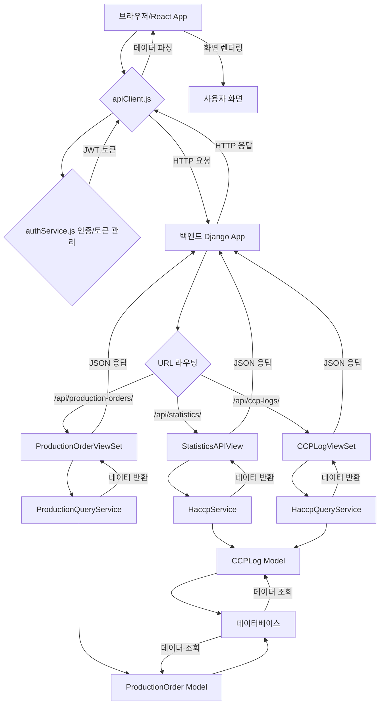

# 프론트엔드 데이터 흐름 (Frontend Data Flow)

이 문서는 HACCP MES 프로젝트에서 백엔드 데이터가 프론트엔드 화면에 어떻게 요청되고, 전달되며, 최종적으로 사용자에게 시각화되는지 그 과정을 파일별로 상세하게 설명합니다.

## 1. 전체 데이터 흐름 개요

데이터는 다음과 같은 주요 단계를 거쳐 흐릅니다.

`브라우저 (React App) <-> apiClient.js <-> authService.js (인증) <-> 백엔드 API (Django) <-> 서비스 레이어 <-> 데이터베이스`

## 2. 파일별 상세 데이터 흐름

### 2.1. `frontend/src/pages/DashboardPage.js` (프론트엔드: 데이터 요청 및 표시)

-   **역할**: 대시보드 화면을 구성하고, 필요한 데이터를 백엔드에 요청하며, 받은 데이터를 화면에 표시합니다.
-   **주요 코드**: `useEffect` 훅 내의 `fetchDashboardData` 함수.
    -   `Promise.all`을 사용하여 여러 API (`/api/statistics/`, `/api/ccp-logs/`, `/api/production-orders/`)를 동시에 호출합니다.
    -   `apiClient.get()`을 통해 백엔드에 HTTP GET 요청을 보냅니다.
    -   응답받은 데이터를 `useState`로 관리하는 `stats`, `recentCcpLogs`, `activeProductionOrders` 상태 변수에 저장합니다.
    -   이 상태 변수들의 값이 변경되면 React는 화면을 자동으로 다시 렌더링하여 최신 데이터를 보여줍니다.

### 2.2. `frontend/src/services/apiClient.js` (프론트엔드: API 요청 처리)

-   **역할**: 모든 백엔드 API 요청을 중앙에서 관리하고 처리합니다. `axios` 라이브러리를 기반으로 합니다.
-   **주요 코드**:
    -   `axios.create()`: 백엔드 기본 URL (`http://localhost:8000`) 및 타임아웃, 기본 헤더(`Content-Type: application/json`)를 설정한 `apiClient` 인스턴스를 생성합니다.
    -   `interceptors.request.use()`: 모든 요청이 백엔드로 가기 전에 `localStorage`에 저장된 JWT `accessToken`을 `Authorization` 헤더에 자동으로 추가합니다. (예: `Bearer <token>`)
    -   `interceptors.response.use()`: 백엔드로부터 응답을 받은 후 처리합니다. 특히, 401 (Unauthorized) 에러 발생 시 `refreshToken`을 사용하여 `accessToken`을 자동으로 갱신하고, 실패한 요청을 재시도하는 로직이 구현되어 있습니다. `refreshToken`마저 만료되면 사용자를 로그인 페이지로 리디렉션합니다.

### 2.3. `frontend/src/services/authService.js` (프론트엔드: 인증 로직)

-   **역할**: 사용자 로그인, 로그아웃, 인증 상태 확인, 토큰 관리 등 인증과 관련된 비즈니스 로직을 담당합니다.
-   **주요 코드**:
    -   `login(credentials)`: `apiClient.post('/api/token/', credentials)`를 호출하여 백엔드로부터 `access` 및 `refresh` 토큰을 발급받습니다. 발급받은 토큰과 사용자 정보를 `localStorage`에 저장합니다.
    -   `isAuthenticated()`, `getCurrentUser()`, `verifyToken()`, `hasRole()` 등: 현재 사용자의 인증 상태 및 권한을 확인하는 헬퍼 함수들을 제공합니다.

### 2.4. `backend/mes_backend/urls.py` 및 `backend/core/urls.py` (백엔드: URL 라우팅)

-   **역할**: 프론트엔드로부터 들어오는 HTTP 요청의 URL을 분석하여, 해당 요청을 처리할 백엔드의 특정 View(뷰)로 연결(라우팅)합니다.
-   **주요 코드**:
    -   `mes_backend/urls.py`: 프로젝트의 최상위 URL 설정 파일입니다. `path('api/', include('core.urls'))`를 통해 `core` 앱의 URL들을 `api/` 경로 아래에 포함시킵니다.
    -   `core/urls.py`: `core` 앱 내의 상세 URL들을 정의합니다.
        -   `router.register()`: `UserViewSet`, `ProductionOrderViewSet` 등 `ViewSet` 기반의 API들을 자동으로 URL에 연결합니다.
        -   `path('statistics/', StatisticsAPIView.as_view(), name='statistics')`: `StatisticsAPIView`와 같이 `ViewSet`이 아닌 일반 `APIView`는 이처럼 `path()` 함수를 사용하여 명시적으로 URL을 등록합니다.

### 2.5. `backend/core/views/production_views.py` (백엔드: `StatisticsAPIView`)

-   **역할**: `/api/statistics/` GET 요청을 받아 대시보드에 필요한 통계 데이터를 생성하고 JSON 형태로 응답합니다.
-   **주요 코드**:
    -   `StatisticsAPIView` 클래스의 `get` 메소드: HTTP GET 요청을 처리합니다.
    -   `HaccpService()` 인스턴스를 생성하여 HACCP 관련 비즈니스 로직을 호출합니다.
    -   `CCPLog.objects.filter()`, `ProductionOrder.objects.filter()` 등 Django ORM을 사용하여 데이터베이스에서 필요한 데이터를 조회하고 필터링합니다.
    -   `Response(data)`: 최종적으로 가공된 통계 데이터를 JSON 형태로 프론트엔드에 반환합니다.

### 2.6. `backend/core/services/haccp_service.py` 및 `production_service.py` (백엔드: 서비스 레이어)

-   **역할**: 복잡한 비즈니스 로직을 캡슐화하고, View와 Model 사이의 중재자 역할을 합니다. 데이터 조회, 계산, 검증 등 핵심 로직이 이곳에 구현됩니다.
-   **주요 코드**:
    -   `HaccpService.calculate_compliance_score()`: HACCP 준수율을 계산합니다. (`production_views.py`의 `StatisticsAPIView`에서 호출)
    -   `ProductionQueryService.get_production_orders_for_user()`: 사용자 권한에 따라 생산 오더를 필터링하여 조회합니다.

### 2.7. `backend/core/models/` (백엔드: 모델)

-   **역할**: 데이터베이스의 테이블 구조를 정의하고, 데이터베이스와의 상호작용(조회, 생성, 수정, 삭제)을 위한 인터페이스를 제공합니다.
-   **주요 모델**: `CCPLog`, `ProductionOrder` 등.

### 2.8. 데이터베이스 (MariaDB)

-   **역할**: 모든 애플리케이션 데이터를 영구적으로 저장합니다.

## 3. 결론

프론트엔드의 `DashboardPage.js`에서 시작된 데이터 요청은 `apiClient.js`를 통해 백엔드로 전달되고, 백엔드의 URL 라우팅을 거쳐 `StatisticsAPIView`에서 처리됩니다. `StatisticsAPIView`는 서비스 레이어를 통해 데이터베이스에서 필요한 정보를 조회하고 가공한 후, 다시 JSON 형태로 프론트엔드에 응답합니다. 프론트엔드는 이 JSON 데이터를 받아 화면에 동적으로 표시함으로써 사용자에게 최신 정보를 제공합니다.
